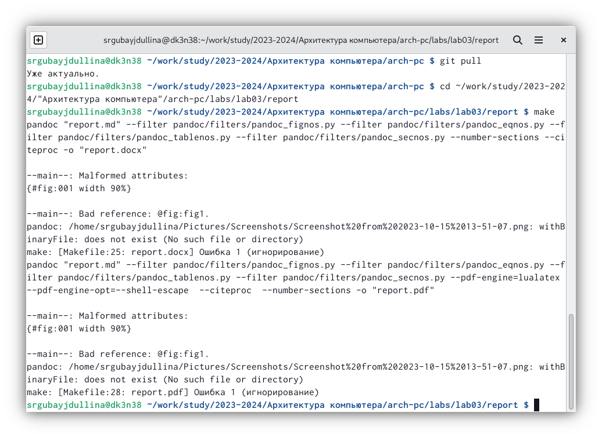
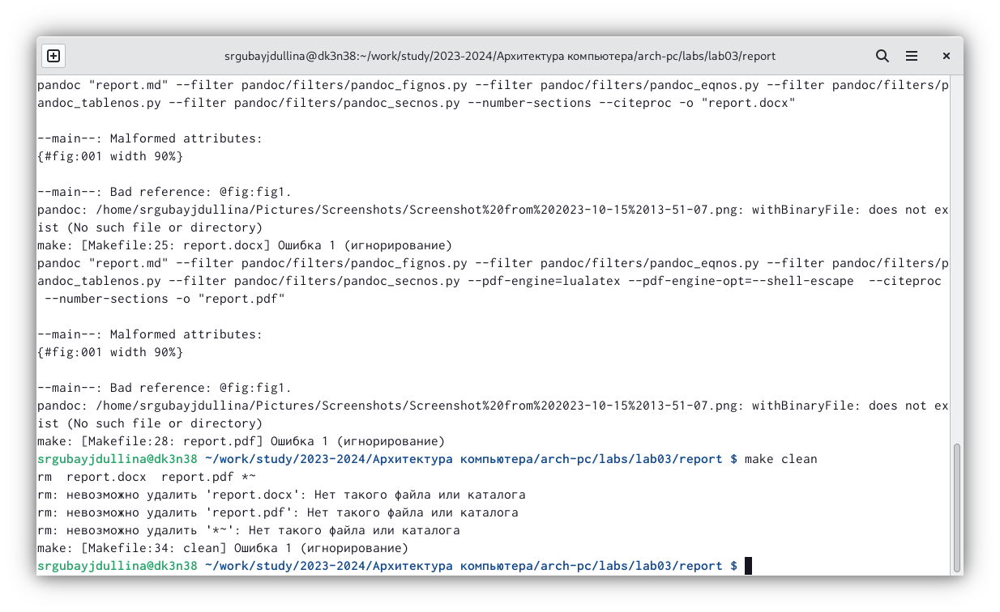
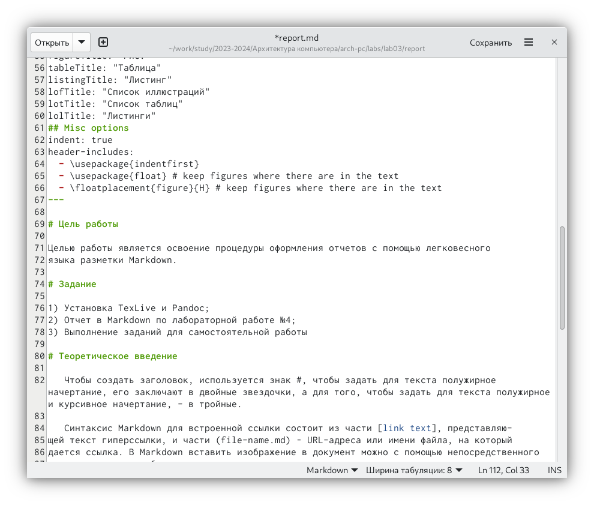
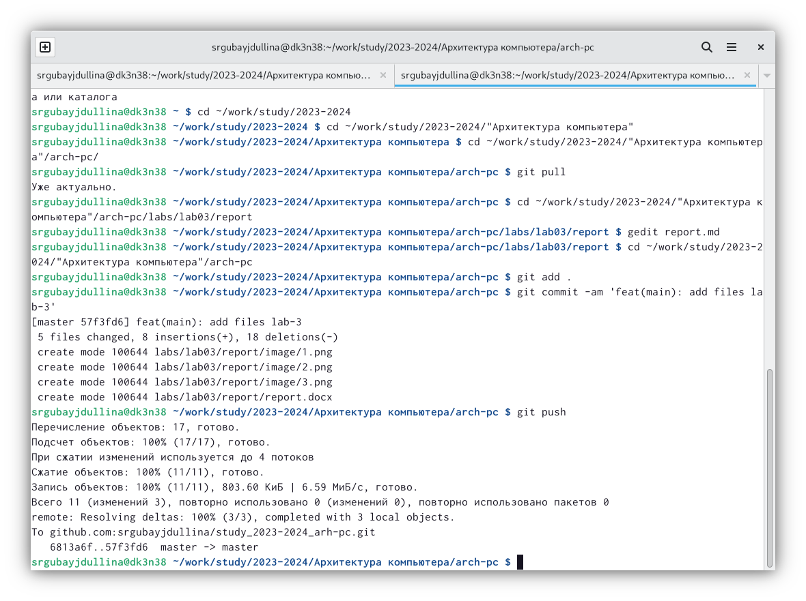

---
## Front matter
title: "Отчет по лабораторной работе №3"
subtitle: "Дисциплина: Архитектура компьютеров и операционные системы"
author: "Губайдуллина Софья Романовна"

## Generic otions
lang: ru-RU
toc-title: "Содержание"

## Bibliography
bibliography: bib/cite.bib
csl: pandoc/csl/gost-r-7-0-5-2008-numeric.csl

## Pdf output format
toc: true # Table of contents
toc-depth: 2
lof: true # List of figures
lot: true # List of tables
fontsize: 12pt
linestretch: 1.5
papersize: a4
documentclass: scrreprt
## I18n polyglossia
polyglossia-lang:
  name: russian
  options:
	- spelling=modern
	- babelshorthands=true
polyglossia-otherlangs:
  name: english
## I18n babel
babel-lang: russian
babel-otherlangs: english
## Fonts
mainfont: PT Serif
romanfont: PT Serif
sansfont: PT Sans
monofont: PT Mono
mainfontoptions: Ligatures=TeX
romanfontoptions: Ligatures=TeX
sansfontoptions: Ligatures=TeX,Scale=MatchLowercase
monofontoptions: Scale=MatchLowercase,Scale=0.9
## Biblatex
biblatex: true
biblio-style: "gost-numeric"
biblatexoptions:
  - parentracker=true
  - backend=biber
  - hyperref=auto
  - language=auto
  - autolang=other*
  - citestyle=gost-numeric
## Pandoc-crossref LaTeX customization
figureTitle: "Рис."
tableTitle: "Таблица"
listingTitle: "Листинг"
lofTitle: "Список иллюстраций"
lotTitle: "Список таблиц"
lolTitle: "Листинги"
## Misc options
indent: true
header-includes:
  - \usepackage{indentfirst}
  - \usepackage{float} # keep figures where there are in the text
  - \floatplacement{figure}{H} # keep figures where there are in the text
---

# Цель работы

Целью работы является освоение процедуры оформления отчетов с помощью легковесного
языка разметки Markdown.

# Задание

1) Установка TexLive и Pandoc;
2) Отчет в Markdown по лабораторной работе №4;
3) Выполнение заданий для самостоятельной работы

# Теоретическое введение

   Чтобы создать заголовок, используется знак #, чтобы задать для текста полужирное начертание, его заключают в двойные звездочки, а для того, чтобы задать для текста полужирное и курсивное начертание, - в тройные.
   
   Синтаксис Markdown для встроенной ссылки состоит из части [link text], представляю-
щей текст гиперссылки, и части (file-name.md) – URL-адреса или имени файла, на который
дается ссылка. В Markdown вставить изображение в документ можно с помощью непосредственного
указания адреса изображения, где:
• в квадратных скобках указывается подпись к изображению;
• в круглых скобках указывается URL-адрес или относительный путь изображения, а так-
же (необязательно) всплывающую подсказку, заключённую в двойные или одиночные
кавычки.
• в фигурных скобках указывается идентификатор изображения (#fig:fig1) для ссылки
на него по тексту и размер изображения относительно ширины страницы (width=90%)
Ссылка на изображение (рис. 3.1) может быть оформлена следующим образом (рис. [-
@fig:fig1])

Преобразовать файл README.md можно следующим образом:
pandoc README.md -o README.pdf
либо:
pandoc README.md -o README.docx

# Выполнение лабораторной работы

1) Перехожу в каталог курса, который был сформирован ранее при выполнении лабораторной работы №2, обновляю локальный репозиторий, после чего перехожу в каталог с шаблоном отчета по лабораторной работе № 3. Провожу проверку компиляции шаблона при помощи Makefile и команды make, после чего удаляю (make clean) (рис. [-@fig:fig1]) (рис. [-@fig:fig2]).

({#fig:001 width=70%}

{#fig:002 width=70%}

При помощи gedit открываю файл для отчета по лабораторной работе report.md и заполняю (рис. [-@fig:fig3])

{#fig:003 width=70%}

В завершении загружаю файлы на GitHub  (рис. [-@fig:fig4]) 

 {#fig:004 width=70%}

# Выводы

В процессе проделанной лабораторной работы я освоила процедуры оформления отчетов с помощью легковесного языка разметки Markdown.

# Список литературы{.unnumbered}

