---
## Front matter
title: "Создание и процесс обработки программ на языке ассемблера NASM"
subtitle: "Лабораторная работа №4"
author: "Губайдуллина Софья Романовна"

## Generic otions
lang: ru-RU
toc-title: "Содержание"

## Bibliography
bibliography: bib/cite.bib
csl: pandoc/csl/gost-r-7-0-5-2008-numeric.csl

## Pdf output format
toc: true # Table of contents
toc-depth: 2
lof: true # List of figures
lot: true # List of tables
fontsize: 12pt
linestretch: 1.5
papersize: a4
documentclass: scrreprt
## I18n polyglossia
polyglossia-lang:
  name: russian
  options:
	- spelling=modern
	- babelshorthands=true
polyglossia-otherlangs:
  name: english
## I18n babel
babel-lang: russian
babel-otherlangs: english
## Fonts
mainfont: PT Serif
romanfont: PT Serif
sansfont: PT Sans
monofont: PT Mono
mainfontoptions: Ligatures=TeX
romanfontoptions: Ligatures=TeX
sansfontoptions: Ligatures=TeX,Scale=MatchLowercase
monofontoptions: Scale=MatchLowercase,Scale=0.9
## Biblatex
biblatex: true
biblio-style: "gost-numeric"
biblatexoptions:
  - parentracker=true
  - backend=biber
  - hyperref=auto
  - language=auto
  - autolang=other*
  - citestyle=gost-numeric
## Pandoc-crossref LaTeX customization
figureTitle: "Рис."
tableTitle: "Таблица"
listingTitle: "Листинг"
lofTitle: "Список иллюстраций"
lotTitle: "Список таблиц"
lolTitle: "Листинги"
## Misc options
indent: true
header-includes:
  - \usepackage{indentfirst}
  - \usepackage{float} # keep figures where there are in the text
  - \floatplacement{figure}{H} # keep figures where there are in the text
---

# Цель работы

Освоение процедуры компиляции и сборки программ, написанных на ассемблере NASM.

# Задание

Порядок выполнения лабораторной работы:

1) Программа Hello world!
2) Расширенный синтаксис командной строки NASM
3) Компоновщик LD
4) Запуск исполняемого файла
5) Задание для самостоятельной работы

# Теоретическое введение

Язык ассемблера (assembly language, сокращённо asm) — машинно-ориентированный
язык низкого уровня. Можно считать, что он больше любых других языков приближен к
архитектуре ЭВМ и её аппаратным возможностям, что позволяет получить к ним более
полный доступ, нежели в языках высокого уровня. Для того, чтобы писать программы на ассемблере, необходимо знать, какие регистры процессора существуют и как их можно использовать.

В основе вычислительного процесса ЭВМ лежит принцип программного управления.
Это означает, что компьютер решает поставленную задачу как последовательность действий,
записанных в виде программы. Программа состоит из машинных команд, которые указыва-
ют, какие операции и над какими данными (или операндами), в какой последовательности
необходимо выполнить. Следует отметить, что процессор понимает не команды ассемблера, а последовательности из нулей и единиц — машинные коды. Преобразование или трансляция команд с
языка ассемблера в исполняемый машинный код осуществляется специальной программой
транслятором — Ассемблер.

Наиболее распространёнными ассемблерами для архитектуры x86 являются:
• для DOS/Windows: Borland Turbo Assembler (TASM), Microsoft Macro Assembler (MASM) и
Watcom assembler (WASM);
• для GNU/Linux: gas (GNU Assembler), использующий AT&T-синтаксис, в отличие от
большинства других популярных ассемблеров, которые используют Intel-синтаксис.

В процессе создания ассемблерной программы можно выделить четыре шага: набор текста, трансляция, компановка (линковка) и запуск программы. Для создания программ на языке ассемблера обычно пользуются утилитами командной строки.

# Выполнение лабораторной работы

1) Для того, чтобы проделать лабораторную работу, мне необходимо создать каталог для работы с программами на языке ассемблера NASM. Перехожу в созданный каталог. При помощи утилиты touch создаю в каталоге текстовый файл с именем hello.asm и открываю при помощи gedit. Ввожу нужный текст.

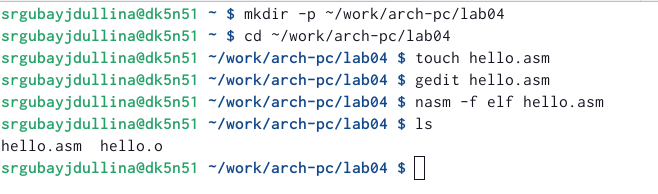{#fig:001 width=90%}

2) Зная, что NASM превращает текст программы в объектный код, ввожу команду nasm, которая скомпилирует исходный файл hello.asm в obj.o. Тут же проверяю правильность введенной операции при помощи ls (рис.2)

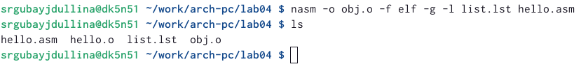{#fig:002 width=90%}

3) Для того, чтобы получить исполняемую программу, объектный файл необходимо передать на обработку компоновщику ld. Сразу проверяю правильность выполненной операции (рис.3).

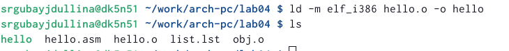{#fig:003 width=90%}

Выполняю следующую команду для компановки файла obj.o (рис.4)

{#fig:004 width=90%}

Также при помощи ld --help я изучила формат командной строки LD (рис.5)

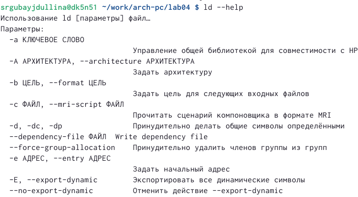{#fig:005 width=90%}

4) Набрав в командной строке ./hello я запускаю на выполнение созданный исполняемый файл, находящийся в текущем каталоге (рис.6)

{#fig:006 width=90%}

5) Далее приступаю к выполнению самостоятельной работы. Для этого в новом каталоге ~/work/arch-pc/lab04 с помощью команды cp создаю копию файла hello.asm с именем lab4.asm (рис.7). При помощи gedit по заданию я меняю текст программы в lab4.asm так, чтобы вместо Hello world! на экран выводилась строка с моими фамилией и именем. (рис.8) 

{#fig:007 width=90%}

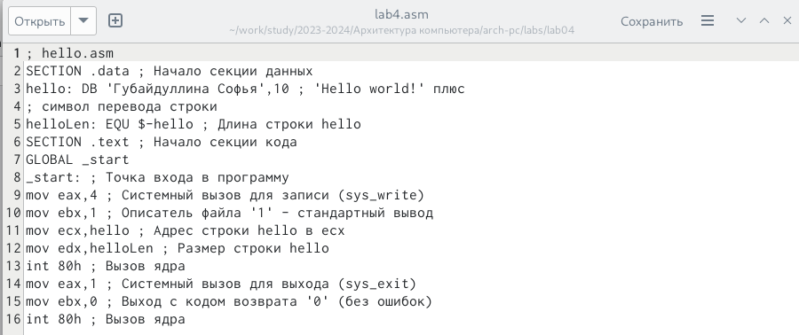{#fig:008 width=90%}

После мне необходимо транслировать полученный текст программы lab4.asm в объектный файл (рис.9) (рис.99).

{#fig:009 width=90%}

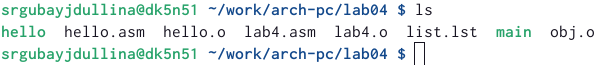{#fig:099 width=90%}

Компаную его и запускаю получившийся исполняемый файл при помощи изученных в ходе лабораторной работы операций (рис.10) (рис.11)

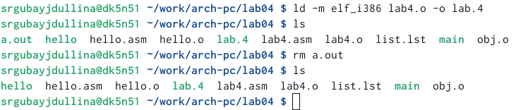{#fig:010 width=90%}

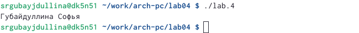{#fig:011 width=90%}

В завершении копирую файлы hello.asm и lab4.asm в свой локальный репозиторий GitHub в привычный каталог ~/work/study/2023-2024/"Архитектура компьютера"/arch-pc/labs/lab04/ (рис.12), удаляя при этом остальные файлы, которые больше мне не пригодятся при помощи утилиты rm (рис.13) 

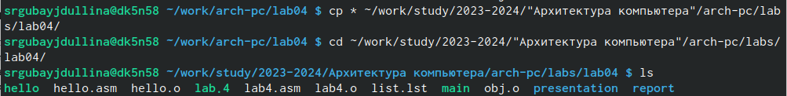{#fig:012 width=90%}

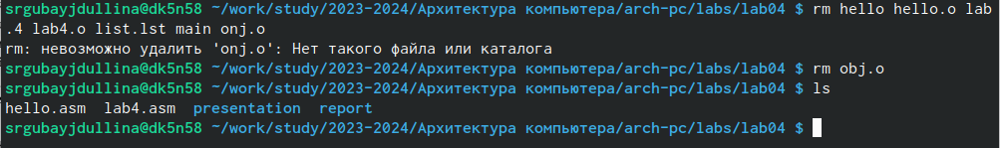{#fig:013 width=90%}

Полученные файлы загружаю в свой репозиторий GitHub (рис.14)

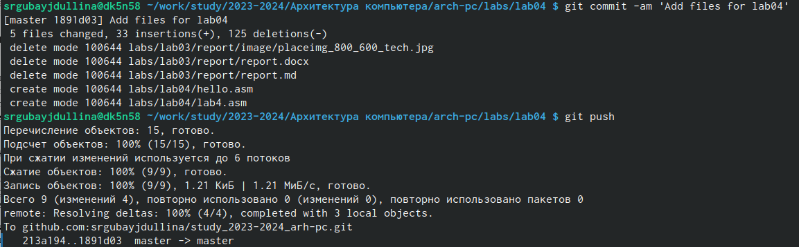{#fig:014 width=90%}

# Выводы

В ходе выполнения лабораторной работы я успешно освоила процедуры компиляции и сборки программ, написанных на ассемблере NASM.
