---
## Front matter
title: "Основы работы с Midnight Commander (mc). Структура программы на языке ассемблера NASM. Системные вызовы в ОС GNU Linux"
subtitle: "Лабораторная работа №5"
author: "Губайдуллина Софья Романовна"

## Generic otions
lang: ru-RU
toc-title: "Содержание"

## Bibliography
bibliography: bib/cite.bib
csl: pandoc/csl/gost-r-7-0-5-2008-numeric.csl

## Pdf output format
toc: true # Table of contents
toc-depth: 2
lof: true # List of figures
lot: true # List of tables
fontsize: 12pt
linestretch: 1.5
papersize: a4
documentclass: scrreprt
## I18n polyglossia
polyglossia-lang:
  name: russian
  options:
	- spelling=modern
	- babelshorthands=true
polyglossia-otherlangs:
  name: english
## I18n babel
babel-lang: russian
babel-otherlangs: english
## Fonts
mainfont: PT Serif
romanfont: PT Serif
sansfont: PT Sans
monofont: PT Mono
mainfontoptions: Ligatures=TeX
romanfontoptions: Ligatures=TeX
sansfontoptions: Ligatures=TeX,Scale=MatchLowercase
monofontoptions: Scale=MatchLowercase,Scale=0.9
## Biblatex
biblatex: true
biblio-style: "gost-numeric"
biblatexoptions:
  - parentracker=true
  - backend=biber
  - hyperref=auto
  - language=auto
  - autolang=other*
  - citestyle=gost-numeric
## Pandoc-crossref LaTeX customization
figureTitle: "Рис."
tableTitle: "Таблица"
listingTitle: "Листинг"
lofTitle: "Список иллюстраций"
lotTitle: "Список таблиц"
lolTitle: "Листинги"
## Misc options
indent: true
header-includes:
  - \usepackage{indentfirst}
  - \usepackage{float} # keep figures where there are in the text
  - \floatplacement{figure}{H} # keep figures where there are in the text
---

# Цель работы

Приобретение практических навыков работы в Midnight Commander. Освоение инструкций
языка ассемблера mov и int.

# Задание

1) Работа в Midnight Commander
2) Подключение внешнего файла in_out.asm
3) Выполнение самостоятельной работы

# Теоретическое введение

Midnight Commander (или просто mc) — это программа, которая позволяет просматривать
структуру каталогов и выполнять основные операции по управлению файловой системой,
т.е. mc является файловым менеджером. Midnight Commander позволяет сделать работу с
файлами более удобной и наглядной.

Программа на языке ассемблера NASM, как правило, состоит из трёх секций: секция кода
программы (SECTION .text), секция инициированных (известных во время компиляции)
данных (SECTION .data) и секция неинициализированных данных (тех, под которые во
время компиляции только отводится память, а значение присваивается в ходе выполнения
программы) (SECTION .bss).

Таким образом, общая структура программы имеет следующий вид:
SECTION .data ; Секция содержит переменные, для
... ; которых задано начальное значение
SECTION .bss ; Секция содержит переменные, для
... ; которых не задано начальное значение
SECTION .text ; Секция содержит код программы
GLOBAL _start
_start: ; Точка входа в программу
... ; Текст программы
mov eax,1 ; Системный вызов для выхода (sys_exit)
mov ebx,0 ; Выход с кодом возврата 0 (без ошибок)
int 80h ; Вызов ядра

Для объявления инициированных данных в секции .data используются директивы DB, DW,
DD, DQ и DT, которые резервируют память и указывают, какие значения должны храниться в
этой памяти. Директивы используются для объявления простых переменных и для объявления масси-
вов. Для определения строк принято использовать директиву DB в связи с особенностями
хранения данных в оперативной памяти.

Инструкция языка ассемблера mov предназначена для дублирования данных источника в
приёмнике. В общем виде эта инструкция записывается в виде
mov dst,src
Здесь операнд dst — приёмник, а src — источник. В качестве операнда могут выступать регистры (register), ячейки памяти (memory) и непо-
средственные значения (const).
Простейший диалог с пользователем требует наличия двух функций — вывода текста на
экран и ввода текста с клавиатуры. Простейший способ вывести строку на экран — использо-
вать системный вызов write. Этот системный вызов имеет номер 4, поэтому перед вызовом
инструкции int необходимо поместить значение 4 в регистр eax.

Для упрощения написания программ часто встречающиеся одинаковые участки кода
(такие как, например, вывод строки на экран или выход их программы) можно оформить
в виде подпрограмм и сохранить в отдельные файлы, а во всех нужных местах поставить
вызов нужной подпрограммы. Это позволяет сделать основную программу более удобной
для написания и чтения.
NASM позволяет подключать внешние файлы с помощью директивы %include, которая
предписывает ассемблеру заменить эту директиву содержимым файла. 

# Выполнение лабораторной работы

1) Прежде всего для начала работы я открываю в терминале Linux Midnight Commader при помощи утилиты  mc.
С помощью клавиш клавиатуры перевигаюсь по директориям и каталогам, перехожу в созданный в 4 лабораторной работе
каталог arch-pc. При помощи F7 создаю папку lab05 и для дальнейшей работы  перехожу непосредственно в неё (рис. @fig:001).

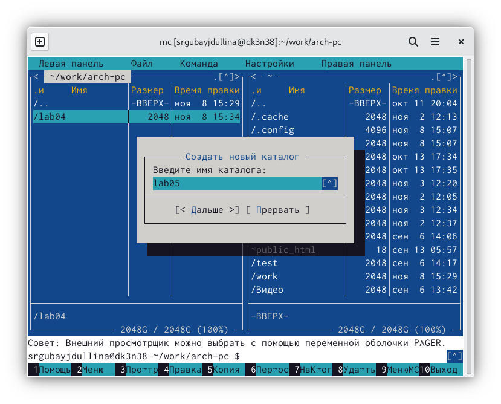{#fig:001 width=70%}

Пользуясь строкой ввода и командой touch, создаю новый файл lab05-1.asm (рис. @fig:002).

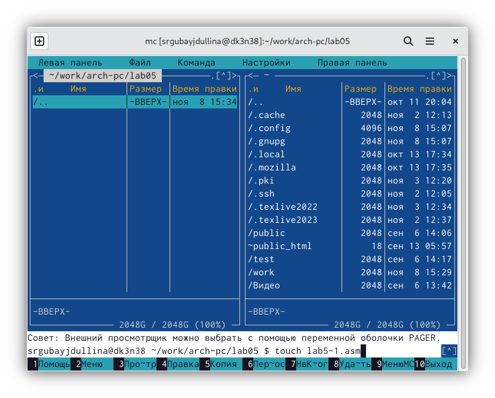{#fig:002 width=70%}

Функциональной клавишей F4 открываю файл lab05-1.asm для редактирования во встроенном редакторе,
после чего ввожу следующий текст из листинга 5.1 (рис. @fig:003):

SECTION .data ; Секция инициированных данных
msg: DB 'Введите строку:',10 ; сообщение плюс
; символ перевода строки
msgLen: EQU $-msg ; Длина переменной 'msg'
SECTION .bss ; Секция не инициированных данных
buf1: RESB 80 ; Буфер размером 80 байт
SECTION .text ; Код программы
GLOBAL _start ; Начало программы
_start: ; Точка входа в программу
mov eax,4 ; Системный вызов для записи (sys_write)
mov ebx,1 ; Описатель файла 1 - стандартный вывод
mov ecx,msg ; Адрес строки 'msg' в 'ecx'
mov edx,msgLen ; Размер строки 'msg' в 'edx'
int 80h ; Вызов ядра
mov eax,1 ; Системный вызов для выхода (sys_exit)
mov ebx,0 ; Выход с кодом возврата 0 (без ошибок)
int 80h ; Вызов ядра

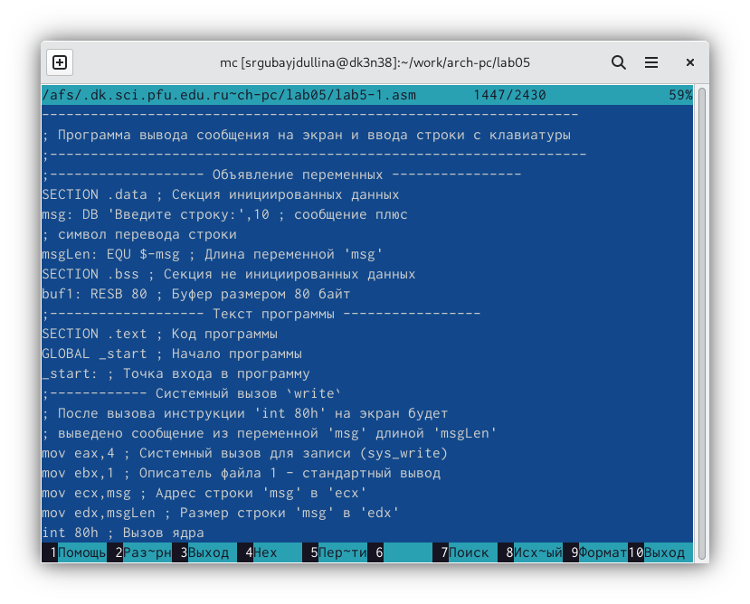{#fig:003 width=70%}

Так как я пользовалась редактором mcedit, то клавишей F2 сохраняю изменения в папке и выхожу
из редактора при помощи F10. Далее функциональная клавиша F3 помогает мне открать файл lab05-1.asm для просмотра.
Убеждаюсь, что файл содержит текст программы.

Далее необходимо транслировать текст программы lab05-1.asm в объектный файл, для этого выполняю
компоновку объектного файла. Запускаю получившийся исполняемый файл при помощи ./lab05-1.asm. Проверяю, что
программа выводит строку 'Введите строку' и ожидает вывода с клавиатуры. На запрос вывожу свои ФИО (рис. @fig:004)

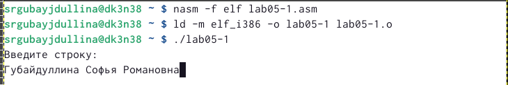{#fig:004 width=70%}
 
2) Начинаю вторую часть работы с установки с ТУИС нужного файла in_out.asm.
С помощью функциональной клавиши F6 создаю копию файла lab05-1.asm с именем lab05-2.asm (рис. @fig:005)

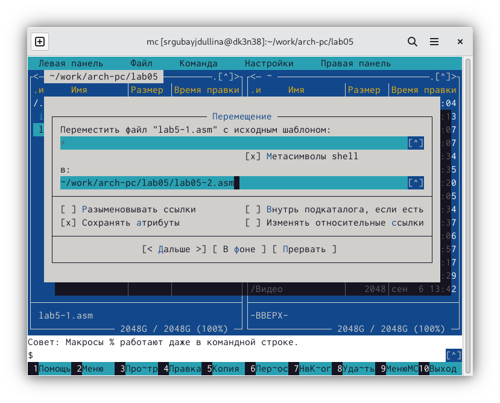{#fig:005 width=70%}

Текст программы изменяю в файле lab5-2.asm с использование подпрограмм из
внешнего файла in_out.asm в соответствии с нижеприведённым листингом 5.2 (рис. @fig:006)

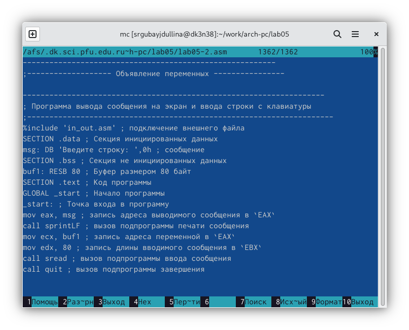{#fig:006 width=70%}

%include 'in_out.asm' ; подключение внешнего файла
SECTION .data ; Секция инициированных данных
msg: DB 'Введите строку: ',0h ; сообщение
SECTION .bss ; Секция не инициированных данных
buf1: RESB 80 ; Буфер размером 80 байт
SECTION .text ; Код программы
GLOBAL _start ; Начало программы
_start: ; Точка входа в программу
mov eax, msg ; запись адреса выводимого сообщения в `EAX`
call sprintLF ; вызов подпрограммы печати сообщения
mov ecx, buf1 ; запись адреса переменной в `EAX`
mov edx, 80 ; запись длины вводимого сообщения в `EBX`
call sread ; вызов подпрограммы ввода сообщения
call quit ; вызов подпрограммы завершения

В завершении основной работы в файле lab05-2.asm заменяю подпрограмму sprintLF на sprint (рис. @fig:007). Это позволит просто вывести
сообщение на экран вместо вывода на экран ещё и сообщения символа перевода строки.

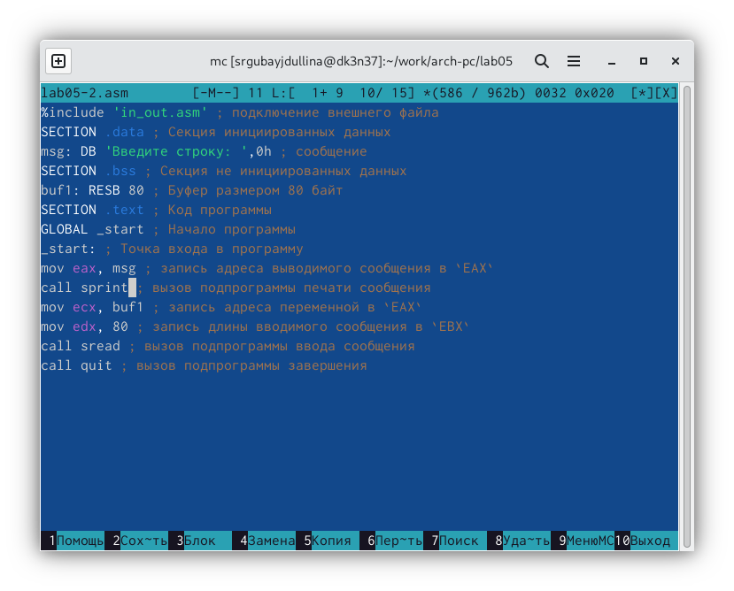{#fig:007 width=70%}

Далее создаю исполняемый файл и проверяю его работу (рис. @fig:008)

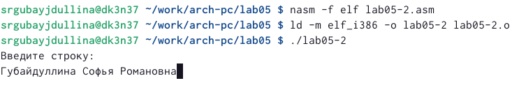{#fig:008 width=70%}

3) Начинаю самостоятельную работу с создания копии файла lab05-1.asm c именем lab05-1-1.asm. Вношу изменения в программу 
без использования внешнего файла in_out.asm так (рис. @fig:009), чтобы она работала по следующему алгоритму:
• вывести приглашение типа “Введите строку:”;
• ввести строку с клавиатуры;
• вывести введённую строку на экран (рис. @fig:010)

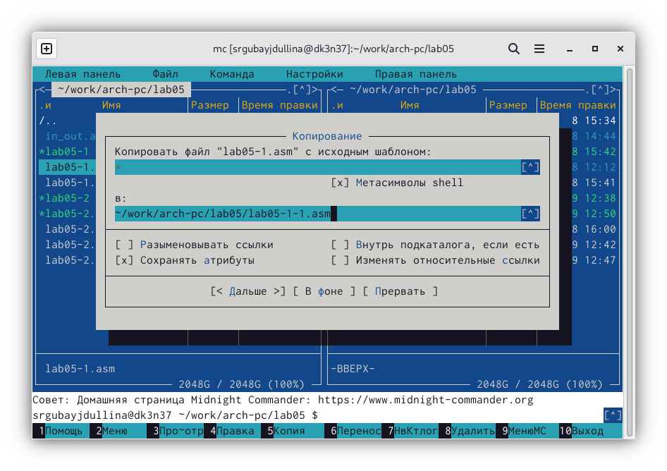{#fig:009 width=70%}

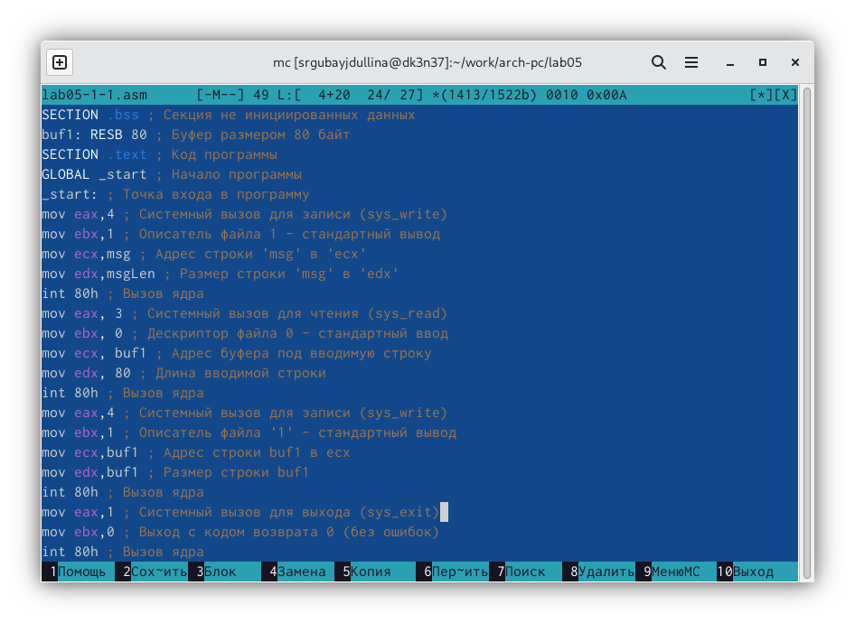{#fig:010 width=70%}

Получаю исполняемый файл и проверяю его работу (рис.). На приглашение ввожу своё ФИО (рис. @fig:011)

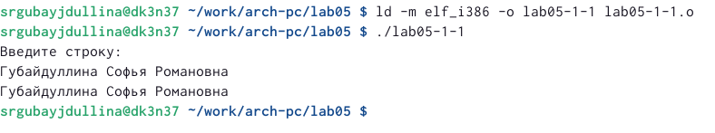{#fig:011 width=70%}

Создаю копию файла lab05-2.asm с именем lab05-2-1.asm. Текст программы исправляю с использованием подпрограмм внешнего
файла in_out.asm так, чтобы она работала по следующему
алгоритму:
• вывести приглашение типа “Введите строку:”;
• ввести строку с клавиатуры;
• вывести введённую строку на экран. (рис. @fig:012)

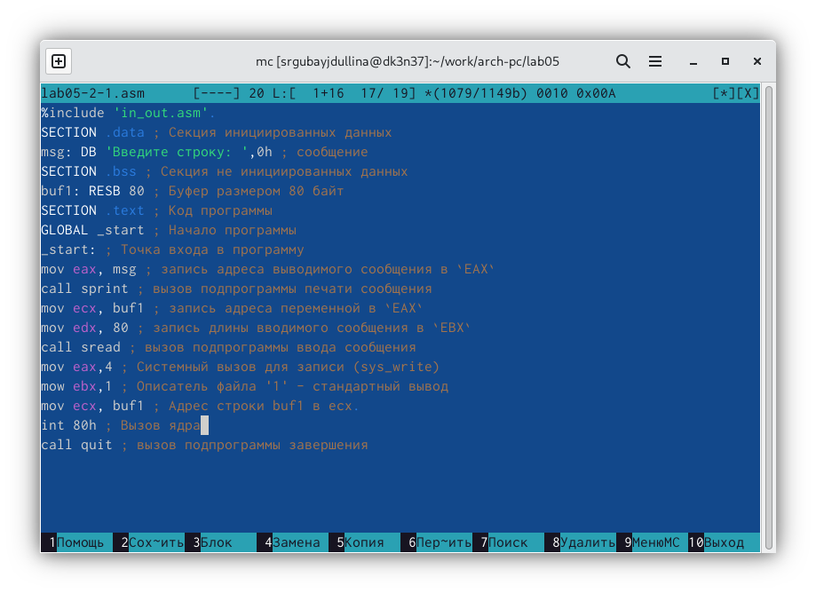{#fig:012 width=70%}

Завершаю самостоятельную часть лабораторной работы созданием исполняемого файла и проверкой его работы (рис. @fig:013)

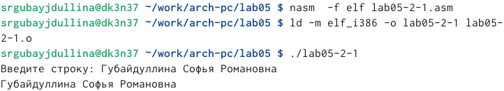{#fig:013 width=70%}

# Выводы

В процессе работы над лабораторной работой №5 я приобрела практические навыки работы
в Midnight Commander, а так же освоенила и изучила инструкции языка ассемблера mov и int.

# Список литературы{.unnumbered}
