---
## Front matter
title: "Арифметические операции в NASM"
subtitle: "Лабораторная работа №6"
author: "Губайдуллина Софья Романовна"

## Generic otions
lang: ru-RU
toc-title: "Содержание"

## Bibliography
bibliography: bib/cite.bib
csl: pandoc/csl/gost-r-7-0-5-2008-numeric.csl

## Pdf output format
toc: true # Table of contents
toc-depth: 2
lof: true # List of figures
lot: true # List of tables
fontsize: 12pt
linestretch: 1.5
papersize: a4
documentclass: scrreprt
## I18n polyglossia
polyglossia-lang:
  name: russian
  options:
	- spelling=modern
	- babelshorthands=true
polyglossia-otherlangs:
  name: english
## I18n babel
babel-lang: russian
babel-otherlangs: english
## Fonts
mainfont: PT Serif
romanfont: PT Serif
sansfont: PT Sans
monofont: PT Mono
mainfontoptions: Ligatures=TeX
romanfontoptions: Ligatures=TeX
sansfontoptions: Ligatures=TeX,Scale=MatchLowercase
monofontoptions: Scale=MatchLowercase,Scale=0.9
## Biblatex
biblatex: true
biblio-style: "gost-numeric"
biblatexoptions:
  - parentracker=true
  - backend=biber
  - hyperref=auto
  - language=auto
  - autolang=other*
  - citestyle=gost-numeric
## Pandoc-crossref LaTeX customization
figureTitle: "Рис."
tableTitle: "Таблица"
listingTitle: "Листинг"
lofTitle: "Список иллюстраций"
lotTitle: "Список таблиц"
lolTitle: "Листинги"
## Misc options
indent: true
header-includes:
  - \usepackage{indentfirst}
  - \usepackage{float} # keep figures where there are in the text
  - \floatplacement{figure}{H} # keep figures where there are in the text
---

# Цель работы

Освоение арифметических инструкций языка ассемблера NASM.

# Задание

1) Символьные и численные данные в NASM
2) Выполнение арифметических операций в NASM
3) Ответы на вопросы по лабораторной работе
4) Задание для самостоятельной работы

# Теоретическое введение

Большинство инструкций на языке ассемблера требуют обработки операндов. Адрес операнда предоставляет место,
где хранятся данные, подлежащие обработке. Это могут быть данные, хранящиеся в регистре
или в ячейке памяти. 

Существует три основных способа адресации:
• Регистровая адресация – операнды хранятся в регистрах и в команде используются
имена этих регистров, например: mov ax,bx.
• Непосредственная адресация – значение операнда задается непосредственно в команде, 
Например: mov ax,2.
• Адресация памяти – операнд задает адрес в памяти. В команде указывается символическое 
обозначение ячейки памяти, над содержимым которой требуется выполнить
операцию.

Схема команды целочисленного сложения add (от англ. addition - добавление) выполняет
сложение двух операндов и записывает результат по адресу первого операнда. Команда add
работает как с числами со знаком, так и без знака и выглядит следующим образом:
add <операнд_1>, <операнд_2>.

Команда целочисленного вычитания sub (от англ. subtraction – вычитание) работает аналогично
команде add и выглядит следующим образом:
sub <операнд_1>, <операнд_2>.

Довольно часто при написании программ встречается операция прибавления или вычитания 
единицы. Прибавление единицы называется инкрементом, а вычитание — декрементом.
Для этих операций существуют специальные команды: inc и dec, которые увеличивают и 
уменьшают на 1 свой операнд.

Еще одна команда, которую можно отнести к арифметическим командам это команда
изменения знака neg:
neg <операнд>
Команда neg рассматривает свой операнд как число со знаком и меняет знак операнда на
противоположный. Операндом может быть регистр или ячейка памяти любого размера.

Умножение и деление, в отличии от сложения и вычитания, для знаковых и беззнаковых
чисел производиться по-разному, поэтому существуют различные команды.
Для беззнакового умножения используется команда mul (от англ. multiply – умножение):
mul <операнд>
Для знакового умножения используется команда imul:
imul <операнд>

Для деления, как и для умножения, существует 2 команды div (от англ. divide - деление) и
idiv:
div <делитель> ; Беззнаковое деление
idiv <делитель> ; Знаковое деление

Ввод информации с клавиатуры и вывод её на экран осуществляется в символьном виде.
Кодирование этой информации производится согласно кодовой таблице символов ASCII.Согласно стандарту ASCII
каждый символ кодируется одним байтом. Первая часть таблицы (символы с кодами 0-127)
является универсальной (см. Приложение.), а вторая (коды 128-255) предназначена для
специальных символов и букв национальных алфавитов и на компьютерах разных типов
может меняться.

Для выполнения лабораторных работ в файле in_out.asm реализованы подпрограммы
для преобразования ASCII символов в числа и обратно. Это:
• iprint – вывод на экран чисел в формате ASCII, перед вызовом iprint в регистр eax
необходимо записать выводимое число (mov eax,<int>).
• iprintLF – работает аналогично iprint, но при выводе на экран после числа добавляет
к символ перевода строки.
• atoi – функция преобразует ascii-код символа в целое число и записает результат
в регистр eax, перед вызовом atoi в регистр eax необходимо записать число (mov
eax,<int>).

# Выполнение лабораторной работы

1) Начинаю выполнение своей лабораторной работы с создания нового каталога,
с которым мне в дальнейшем придется работать, после чего перехожу в него и создаю
нужный мне файл lab6-1.asm (рис. @fig:001).

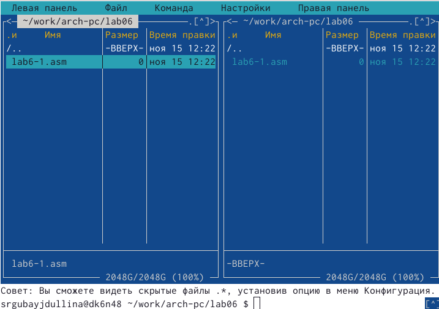{#fig:001 width=70%}

В lab6-1.asm при помощи F4 ввожу следующий листинг:

%include 'in_out.asm'
SECTION .bss
buf1: RESB 80
SECTION .text
GLOBAL _start
_start:
mov eax,'6'
mov ebx,'4'
add eax,ebx
mov [buf1],eax
mov eax,buf1
call sprintLF
call quit

В данной программе в регистр eax записывается символ 6 (mov eax,'6'),
в регистр ebx символ 4 (mov ebx,'4'), после чего к значению в регистре eax прибавляется 
значение регистра ebx (add eax,ebx, результат сложения запишется в регистр eax). (рис. @fig:002)

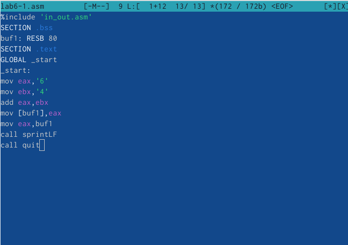{#fig:002 width=70%}

Создаю через терминал исполняемый файл файла lab6-1.asm и запускаю его, 
получая необходимый результат (рис. @fig:003).

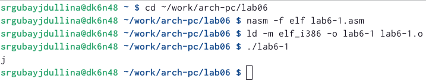{#fig:003 width=70%}

Далее по заданию изменяю  текст программы и вместо символов записываю в регистры числа следующим образом:
Меняю mov eax,'6'
mov ebx,'4' 
на строки
mov eax,6
mov ebx,4  (рис. @fig:004)

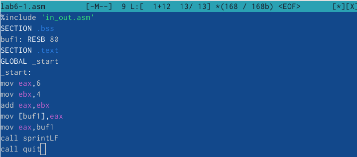{#fig:004 width=70%}

Создаю новый исполняемый файл и запускаю его, получая ожидаемый результат (рис. @fig:005).
Согласно таблице ASCII 10 соответствует следующим символам: 0A,◙,LF. При выводе на экран
символ не отображается.

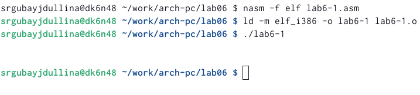{#fig:005 width=70%}

Далее создаю файл lab6-2.asm в каталоге ~/work/arch-pc/lab06 и ввожу в него текст программы
из листинга 6.2 (рис. @fig:006):

%include 'in_out.asm'
SECTION .text
GLOBAL _start
_start:
mov eax,'6'
mov ebx,'4'
add eax,ebx
call iprintLF
call qui

{#fig:006 width=70%}

Проделываю все то же самое, а именно: созданию исполняемый файл для lab6-2.asm и
запускаю его (рис. @fig:007). В результате работы программы получаю число 106.

{#fig:007 width=70%}

Аналогично предыдущему примеру заменяю символы на числа, а именно:
mov eax,'6'
mov ebx,'4'
на строки
mov eax,6
mov ebx,4

Создаю исполняемый файл и запускаю (рис. @fig:008)

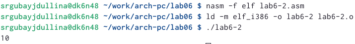{#fig:008 width=70%}

На этот раз я снова меняю текст программы: теперь заменим функцию iprintLF на iprint.
iprint это вывод на экран чисел в формате ASCII, тогда как iprintLF при выводе на экран 
после числа добавляет к символ перевода строки.
Снова создаю исполняемый файл для нового lab6-2.asm, после чего запускаю (рис. @fig:009)

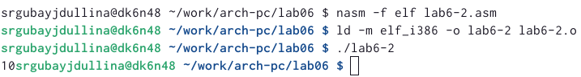{#fig:009 width=70%}

2) Для выполнения второй части лабораторной работы мне необходимо создать новый файл lab6-3.asm, после чего
в новый файл при помощи F4 ввожу следующий листинг - программу для вычисления выражения
f(𝑥) = (5 ∗ 2 + 3)/3 (рис. @fig:010):

%include 'in_out.asm' ; подключение внешнего файла
SECTION .data
div: DB 'Результат: ',0
rem: DB 'Остаток от деления: ',0
SECTION .text
GLOBAL _start
_start:
; ---- Вычисление выражения
mov eax,5 ; EAX=5
mov ebx,2 ; EBX=2
mul ebx ; EAX=EAX*EBX
add eax,3 ; EAX=EAX+3
xor edx,edx ; обнуляем EDX для корректной работы div
mov ebx,3 ; EBX=3
div ebx ; EAX=EAX/3, EDX=остаток от деления
mov edi,eax ; запись результата вычисления в 'edi'
mov eax,div ; вызов подпрограммы печати
call sprint ; сообщения 'Результат: '
mov eax,edi ; вызов подпрограммы печати значения
call iprintLF ; из 'edi' в виде символов
mov eax,rem ; вызов подпрограммы печати
call sprint ; сообщения 'Остаток от деления: '
mov eax,edx ; вызов подпрограммы печати значения
call iprintLF ; из 'edx' (остаток) в виде символов
call quit ; вызов подпрограммы завершения

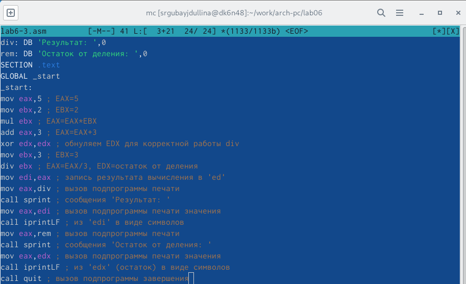{#fig:010 width=70%}

Как и ранее создаю исполняемый файл и запускаю его (рис. @fig:011)

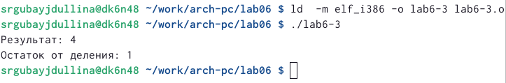{#fig:011 width=70%}

Теперь мне необходимо скорректировать программу из листинга в lab6-3.asm для вычисления
выражения 𝑓(𝑥) = (4 ∗ 6 + 2)/5 (рис. @fig:012)

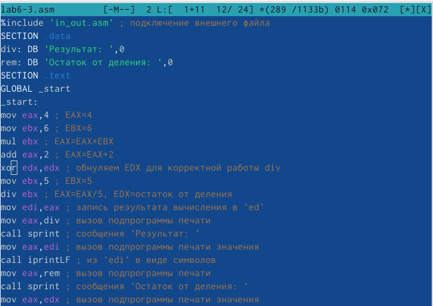{#fig:012 width=70%}

Создаю исполняемый файл, запускаю (рис. @fig:013)

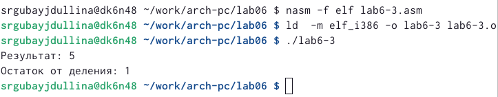{#fig:013 width=70%}

Для дальнейших не необходим новый файл - создаю variant.asm в каталоге ~/work/arch-pc/lab06 (рис. @fig:014)

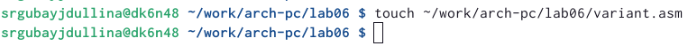{#fig:014 width=70%}

С F4 ввожу в новый файл программа для вычисления варианта задания по номеру студенческого билета
из следующего листинга (рис. @fig:015):

%include 'in_out.asm'
SECTION .data
msg: DB 'Введите № студенческого билета: ',0
rem: DB 'Ваш вариант: ',0
SECTION .bss
x: RESB 80
SECTION .text
GLOBAL _start
_start:
mov eax, msg
call sprintLF
mov ecx, x
mov edx, 80
call sread
mov eax,x ; вызов подпрограммы преобразования
call atoi ; ASCII кода в число, `eax=x'
xor edx,edx
mov ebx,20
div ebx
inc edx
mov eax,rem
call sprint
mov eax,edx
call iprintLF
call quit

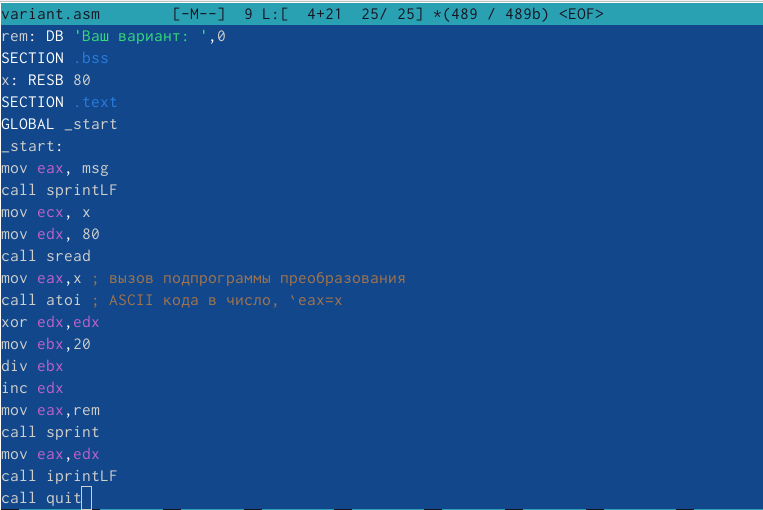{#fig:015 width=70%}

Создаю исполняемый файл для variant.asm и запускаю. Мой вариант - 20 (рис. @fig:016)

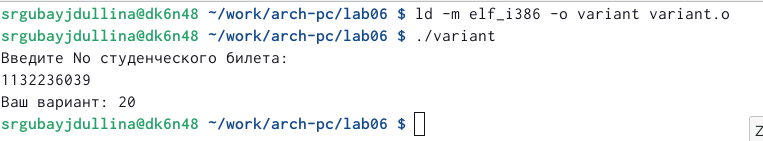{#fig:016 width=70%}

3) Ответы на вопросы:
   1. mov eax, rem
      call sprintLF/call sprint - строки, отвечающие за вывод сообщения 'Ваш вариант:'
   2. Первая строчка (mov ecx,x) кладет в ecx адрес строки x. 
      mov edx, 80 записывает в edx длину вводимой строки
      call sread - вызов подпрограммы из файла извне.
   3. Функция call atoi вызывает подпрограммы из внешнего файла. Программа преобразовывает ASCII код
      символ в число.
   4. xor edx,edx
      mov ebx,20
      div ebx
      inc edx        - вычисление варианта 
   5. Остаток от деления div ebx запишется соответственно в регистр edx.
   6. Инструкция inc edx используется для увеличения значения регистра (здесь edx) на 1.
   7. Для того, чтобы вывести на экран результат вычисления мы используем:
      mov eax,edx
      call iprintLF
      
4) Для начала выполнения самостоятельной работы мне потребуется файл в lab06 с нужным листингом для 
его дальнейшего редактирования, чтобы решить поставленную задачу. Решаю работать в файле lab6-3.asm
с последующим его редактированием. Открываю при помощи F4. 

  Необходимо править программу, чтобы решать пример из варианта 20 - x^3 ⋅ 1/3 + 21  (рис. @fig:017)
  
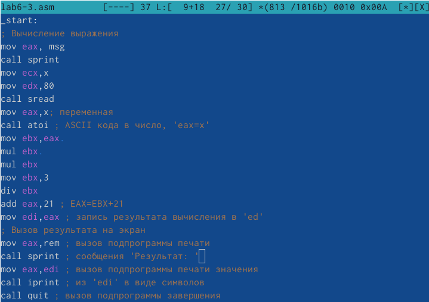{#fig:017 width=70%}

 Создаю исполняемый файл и запускаю, подставляя данные для х значения: сначала 1, затем 3 (рис. @fig:018)
 
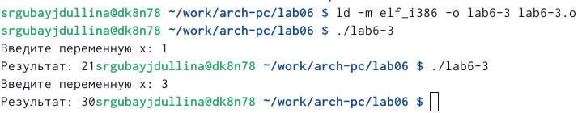{#fig:018 width=70%}

Листинг для вычисления x^3*(1/3)+21:

%include 'in_out.asm' ; подключение внешнего файла
SECTION .data
msg: DB 'Введите значения переменной х: ',0
rem: DB 'Результат: ', 0
x: RESB 80; переменная
SECTION .text
GLOBAL _start
_start:
; ---- Вычисление выражения
mov eax, msg ;
call sprint;
mov ecx,x
mo edx,80
call sread
mov eax,x ; переменная 
call atoi
mov ebx, eax
mul ebx
mul ebx
mov ebx,3
div ebx
add eax,21 ; EAX=EBX+21
mul ebx ; EAX=EAX*EBX
add eax,3 ; EAX=EAX+3
mov edi,eax ; запись результата вычисления в 'edi'
mov eax,rem ; вызов подпрограммы печати
call sprint ; сообщения 'Результат: '
mov eax,edi ; вызов подпрограммы печати значения
call iprint ; из 'edi' в виде символов
call quit ; вызов подпрограммы завершения.
  
# Выводы

В ходе выполнения лабораторной работы я освоила арифметические инструкции языка ассемблера NASM.

# Список литературы{.unnumbered}
