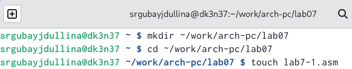
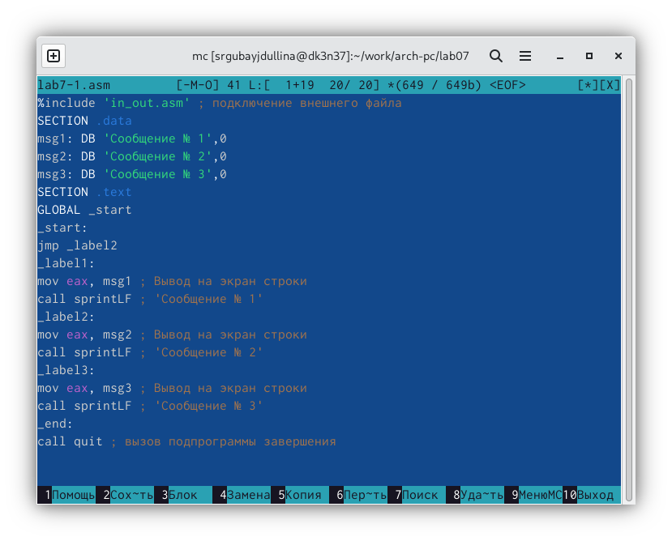
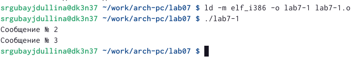
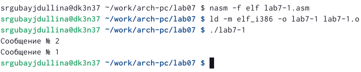
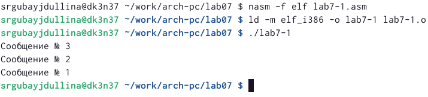
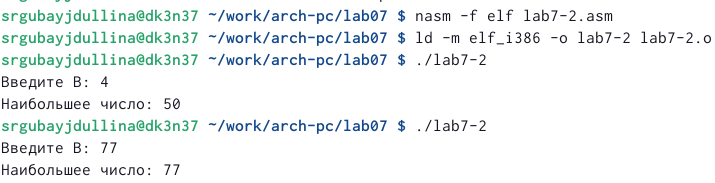
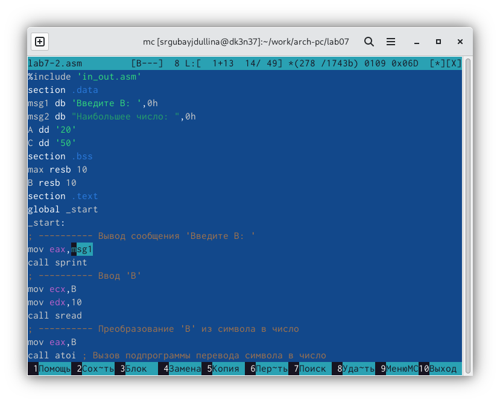
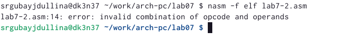
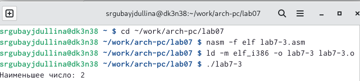
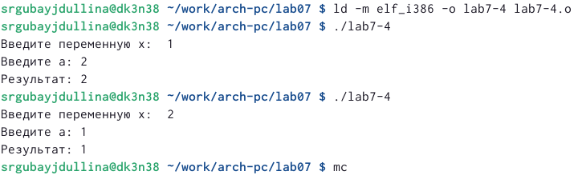

---
## Front matter
title: "Команды безусловного и условного переходов в Nasm. Программирование ветвлений."
subtitle: "Лабораторная работа №7"
author: "Губайдуллина Софья Романовна"

## Generic otions
lang: ru-RU
toc-title: "Содержание"

## Bibliography
bibliography: bib/cite.bib
csl: pandoc/csl/gost-r-7-0-5-2008-numeric.csl

## Pdf output format
toc: true # Table of contents
toc-depth: 2
lof: true # List of figures
lot: true # List of tables
fontsize: 12pt
linestretch: 1.5
papersize: a4
documentclass: scrreprt
## I18n polyglossia
polyglossia-lang:
  name: russian
  options:
	- spelling=modern
	- babelshorthands=true
polyglossia-otherlangs:
  name: english
## I18n babel
babel-lang: russian
babel-otherlangs: english
## Fonts
mainfont: PT Serif
romanfont: PT Serif
sansfont: PT Sans
monofont: PT Mono
mainfontoptions: Ligatures=TeX
romanfontoptions: Ligatures=TeX
sansfontoptions: Ligatures=TeX,Scale=MatchLowercase
monofontoptions: Scale=MatchLowercase,Scale=0.9
## Biblatex
biblatex: true
biblio-style: "gost-numeric"
biblatexoptions:
  - parentracker=true
  - backend=biber
  - hyperref=auto
  - language=auto
  - autolang=other*
  - citestyle=gost-numeric
## Pandoc-crossref LaTeX customization
figureTitle: "Рис."
tableTitle: "Таблица"
listingTitle: "Листинг"
lofTitle: "Список иллюстраций"
lotTitle: "Список таблиц"
lolTitle: "Листинги"
## Misc options
indent: true
header-includes:
  - \usepackage{indentfirst}
  - \usepackage{float} # keep figures where there are in the text
  - \floatplacement{figure}{H} # keep figures where there are in the text
---

# Цель работы

Цель данной лабораторной работы - изучить команды условного и безусловного переходов, приобрести навыки написания
программ с использованием переходов, а так же ознакомиться с назначением и структурой файла
листинга.

# Задание

1) Реализация переходов в NASM;
2) Изучение структуры файла листинга;
3) Выполнение самостоятельной работы

# Теоретическое введение

Для реализации ветвлений в ассемблере используются так называемые команды передачи
управления или команды перехода. Можно выделить 2 типа переходов:
• условный переход – выполнение или не выполнение перехода в определенную точку
программы в зависимости от проверки условия.
• безусловный переход – выполнение передачи управления в определенную точку про-
граммы без каких-либо условий.

Безусловный переход выполняется инструкцией jmp (от англ. jump – прыжок), которая
включает в себя адрес перехода, куда следует передать управление:
jmp <адрес_перехода>

Для условного перехода необходима проверка какого-либо условия.
В ассемблере команды условного перехода вычисляют условие перехода анализируя флаги
из регистра флагов. Флаг – это бит, принимающий значение 1 («флаг установлен»),
если выполнено некоторое условие, и значение 0 («флаг сброшен») в противном случае.
Флаги работают независимо друг от друга, и лишь для удобства они помещены в единый
регистр — регистр флагов, отражающий текущее состояние процессора.

Инструкция cmp является одной из инструкций, которая позволяет сравнить операнды и
выставляет флаги в зависимости от результата сравнения.
Инструкция cmp является командой сравнения двух операндов и имеет такой же формат,
как и команда вычитания:
cmp <операнд_1>, <операнд_2>

Команда условного перехода имеет вид
j<мнемоника перехода> label
Мнемоника перехода связана со значением анализируемых флагов или со способом фор-
мирования этих флагов.

Листинг (в рамках понятийного аппарата NASM) — это один из выходных файлов, созда-
ваемых транслятором. Он имеет текстовый вид и нужен при отладке программы, так как
кроме строк самой программы он содержит дополнительную информацию. Все ошибки и предупреждения,
обнаруженные при ассемблировании, транслятор выводит
на экран, и файл листинга не создаётся.

# Выполнение лабораторной работы

1) Сперва начинаю работу с создания нового каталога и файла в нем для последующей работы, после чего в новый файл 
lab7-1.asm ввожу листинг 1. (рис. @fig:001) (рис. @fig:002).

{#fig:001 width=70%}

Листинг 7.1. Программа с использованием инструкции jmp

%include 'in_out.asm' ; подключение внешнего файла
SECTION .data
msg1: DB 'Сообщение № 1',0
msg2: DB 'Сообщение № 2',0
msg3: DB 'Сообщение № 3',0
SECTION .text
GLOBAL _start
_start:
jmp _label2
_label1:
mov eax, msg1 ; Вывод на экран строки
call sprintLF ; 'Сообщение № 1'
_label2:
mov eax, msg2 ; Вывод на экран строки
call sprintLF ; 'Сообщение № 2'
_label3:
mov eax, msg3 ; Вывод на экран строки
call sprintLF ; 'Сообщение № 3'
_end:
call quit ; вызов подпрограммы завершения

{#fig:002 width=70%}

Далее создаю исполняемый файл для lab7-1.asm и проверю его работу.
Программа работает успешно (рис. @fig:003). 

{#fig:003 width=70%}

Таким образом, использование инструкции jmp _label2 меняет порядок исполнения
инструкций и позволяет выполнить инструкции начиная с метки _label2, пропустив вывод
первого сообщения. Следуя по заданию, мне необходимо изменить файл lab7-1.asm в соответствии со следующим листингом 
при помощи F4:

Листинг 7.2. Программа с использованием инструкции jmp
%include 'in_out.asm' ; подключение внешнего файла
SECTION .data
msg1: DB 'Сообщение № 1',0
msg2: DB 'Сообщение № 2',0
msg3: DB 'Сообщение № 3',0
SECTION .text
GLOBAL _start
_start:
jmp _label2
_label1:
mov eax, msg1 ; Вывод на экран строки
call sprintLF ; 'Сообщение № 1'
jmp _end
_label2:
mov eax, msg2 ; Вывод на экран строки
call sprintLF ; 'Сообщение № 2'
jmp _label1
_label3:
mov eax, msg3 ; Вывод на экран строки
call sprintLF ; 'Сообщение № 3'
_end:
call quit ; вызов подпрограммы завершения

Создаю новый исполняемый файл и проверяю его работу (рис. @fig:004).

{#fig:004 width=70%}

Далее мне нужно изменить текст файла таким образом, чтобы программа выводила сначала 
сообщение №3, затем №2 и после №1 пр помощи перестановки инструкций jmp. Ниже представлен листинг
для выполнения программы:

%include 'in_out.asm' ; подключение внешнего файла
SECTION .data
msg1: DB 'Сообщение № 1',0
msg2: DB 'Сообщение № 2',0
msg3: DB 'Сообщение № 3',0
SECTION .text
GLOBAL _start
_start:
jmp _label3
_label1:
mov eax, msg1 ; Вывод на экран строки
call sprintLF ; 'Сообщение № 1'
jmp _end
_label2:
mov eax, msg2 ; Вывод на экран строки
call sprintLF ; 'Сообщение № 2'
jmp _label1
_label3:
mov eax, msg3 ; Вывод на экран строки
call sprintLF ; 'Сообщение № 3'
jmp _label2
_end:
call quit ; вызов подпрограммы завершения

Создаю файл и проверяю его на правильность выполнения (рис. @fig:005).

{#fig:005 width=70%}

Следуя по заданию, создаю новый файл lab7-2.asm и ввожу туда следующий текст из листинга:

Листинг 7.3. Программа, которая определяет и выводит на экран наибольшую из 3
целочисленных переменных: A,B и C.
%include 'in_out.asm'
section .data
msg1 db 'Введите B: ',0h
msg2 db "Наибольшее число: ",0h
A dd '20'
C dd '50'
section .bss
max resb 10
B resb 10
ection .text
global _start
_start:
; ---------- Вывод сообщения 'Введите B: '
mov eax,msg1
call sprint
; ---------- Ввод 'B'
mov ecx,B
mov edx,10
call sread
; ---------- Преобразование 'B' из символа в число
mov eax,B
call atoi ; Вызов подпрограммы перевода символа в число
mov [B],eax ; запись преобразованного числа в 'B'
; ---------- Записываем 'A' в переменную 'max'
mov ecx,[A] ; 'ecx = A'
mov [max],ecx ; 'max = A'
; ---------- Сравниваем 'A' и 'С' (как символы)
cmp ecx,[C] ; Сравниваем 'A' и 'С'
jg check_B ; если 'A>C', то переход на метку 'check_B',
mov ecx,[C] ; иначе 'ecx = C'
mov [max],ecx ; 'max = C'
; ---------- Преобразование 'max(A,C)' из символа в число
check_B:
mov eax,max
call atoi ; Вызов подпрограммы перевода символа в число
mov [max],eax ; запись преобразованного числа в `max`
; ---------- Сравниваем 'max(A,C)' и 'B' (как числа)
mov ecx,[max]
cmp ecx,[B] ; Сравниваем 'max(A,C)' и 'B'
jg fin ; если 'max(A,C)>B', то переход на 'fin',
mov ecx,[B] ; иначе 'ecx = B'
mov [max],ecx
; ---------- Вывод результата
fin:
mov eax, msg2
call sprint ; Вывод сообщения 'Наибольшее число: '
mov eax,[max]
call iprintLF ; Вывод 'max(A,B,C)'
call quit ; Выход

Создаю исполняемый файл и проверяю его работу для разных значений B (рис. @fig:006).

{#fig:006 width=70%}

2) Теперь мне нужно создать файл lab7-2.lst при помощи ключа -l из файла lab7-2.asm. Открываю
только что созданый файл при помощи mcedit и ознакамливаюсь с его форматом и содержимым. Далее открываю
файл с программой lab7-2.asm и удаляю один из операндов, который выделен на рисунке (рис. @fig:007).

{#fig:007 width=70%}

Выполняю трансляцию с полуением файла листинга. Исполняемые файлы не могут быть созданы из-за
возникающей ошибки при недостатке одного из операндов (рис. @fig:008).

{#fig:008 width=70%}

3) Теперь приступаю к выполнению самостоятельной работы. Создаю новый файл lab7-3.asm для дальнейшей работы в нем.
По заданию мне необходимо написать программу нахождения наименьшей из 3 переменных из варианта 20 таблицы 7.5 (эти значения - 95,2,61).
Ниже представлен мой листинг для выполнения этой программы, где листинг преимущественно построен на сравнении (операции с cmp)
для сравнения в наименьшую сторону (операции jl):

%include 'in_out.asm'
section .data
msg1 db 'Введите B: ',0h
msg2 db "Наименьшее число: ",0h
A dd '95'
B dd '2'
C dd '61'
section .bss
max resb 10
section .text
global _start
_start:
; ---------- Преобразование 'B' из символа в число
mov eax,B
call atoi ; Вызов подпрограммы перевода символа в число
mov [B],eax ; запись преобразованного числа в 'B'
; ---------- Записываем 'A' в переменную 'min'
mov ecx,[A] ; 'ecx = A'
mov [min],ecx ; 'min = A'
; ---------- Сравниваем 'A' и 'С' (как символы)
cmp ecx,[C] ; Сравниваем 'A' и 'С'
jl check_B ; если 'A>C', то переход на метку 'check_B',
mov ecx,[C] ; иначе 'ecx = C'
mov [min],ecx ; 'min = C'
; ---------- Преобразование 'min(A,C)' из символа в число
check_B:
mov eax,min
call atoi ; Вызов подпрограммы перевода символа в число
mov [min],eax ; запись преобразованного числа в `min`
; ---------- Сравниваем 'min(A,C)' и 'B' (как числа)
mov ecx,[min]
cmp ecx,[B] ; Сравниваем 'min(A,C)' и 'B'
jl fin ; если 'min(A,C)>B', то переход на 'fin',
mov ecx,[B] ; иначе 'ecx = B'
mov [min],ecx
; ---------- Вывод результата
fin:
mov eax, msg
call sprint ; Вывод сообщения 'Наименьшее число: '
mov eax,[min]
call iprintLF ; Вывод 'min(A,B,C)'
call quit ; Выход

Создаю исполняемый файл и проверяю его работу (рис. @fig:009)

{#fig:009 width=70%}

Далее мне необходимо будет создать новый файл lab7-4.asm для написания программы, которая для значений x,a, введенных с клавиатуры
вычисляет значение функции. Мой вариант 20 (для значений (1;2) (2;1)). Данная функция: { (x-a), x>=a
                                                                                       { 5,     x<a
Здесь представлен листинг для выполнения программы:

%include 'in_out.asm'
section .data
msg1 DB 'Введите переменную x: ',0h
msg2 DB 'Введите переменную a: ',0h
msg3 DB 'Результат: ', 0h
section .bss
x: RESB 80
a: RESB 80
section .text
global _start
_start:
; Выражение вычисления
mov eax,msg1
call sprint
mov ecx,x
mov edx,80
call sread
mov eax,x
call atoi ; Вызов подпрограммы перевода символа в число
mov eax,a 
jge _motionx
mov eax,msg2
mov edx,80
call sread
mov eax,a
jl _motion
jmp _motion
mov ecx,edx 
_motion:
mov edx,5
jmp _end
_end:
mov ecx,eax
mov eax,msg3
call sprint 
mov eax,ecx
call iprintLF
call quit 

Создаю исполняемый файл и проверяю работу (рис. @fig:010)

{#fig:010 width=70%}

# Выводы

При выполнении лабораторной работы я изучила команды условного и безусловного переходов, приобрела навыки написания
программ с использованием переходов, а так же ознакомилась с назначением и структурой файла
листинга.

:::
