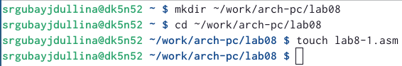
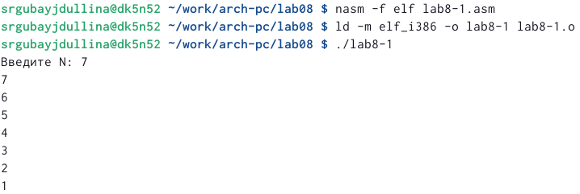
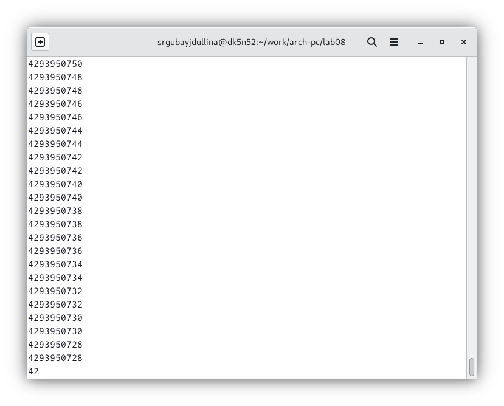
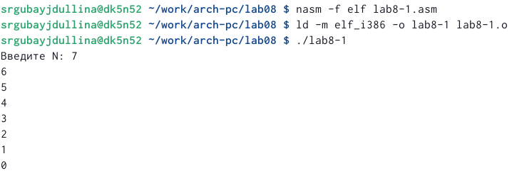
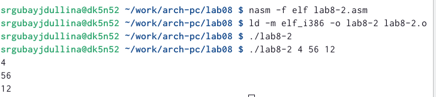
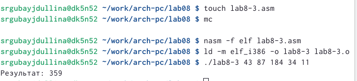
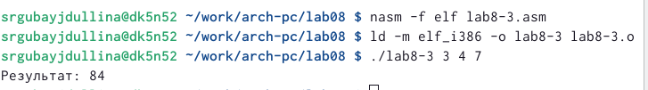
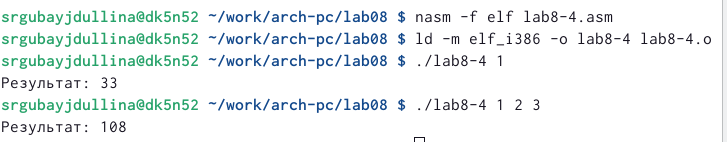

---
## Front matter
title: " Программирование цикла. Обработка аргументов командной строки."
subtitle: "Лабораторная работа №8"
author: "Губайдуллина Софья Романовна"

## Generic otions
lang: ru-RU
toc-title: "Содержание"

## Bibliography
bibliography: bib/cite.bib
csl: pandoc/csl/gost-r-7-0-5-2008-numeric.csl

## Pdf output format
toc: true # Table of contents
toc-depth: 2
lof: true # List of figures
lot: true # List of tables
fontsize: 12pt
linestretch: 1.5
papersize: a4
documentclass: scrreprt
## I18n polyglossia
polyglossia-lang:
  name: russian
  options:
	- spelling=modern
	- babelshorthands=true
polyglossia-otherlangs:
  name: english
## I18n babel
babel-lang: russian
babel-otherlangs: english
## Fonts
mainfont: PT Serif
romanfont: PT Serif
sansfont: PT Sans
monofont: PT Mono
mainfontoptions: Ligatures=TeX
romanfontoptions: Ligatures=TeX
sansfontoptions: Ligatures=TeX,Scale=MatchLowercase
monofontoptions: Scale=MatchLowercase,Scale=0.9
## Biblatex
biblatex: true
biblio-style: "gost-numeric"
biblatexoptions:
  - parentracker=true
  - backend=biber
  - hyperref=auto
  - language=auto
  - autolang=other*
  - citestyle=gost-numeric
## Pandoc-crossref LaTeX customization
figureTitle: "Рис."
tableTitle: "Таблица"
listingTitle: "Листинг"
lofTitle: "Список иллюстраций"
lotTitle: "Список таблиц"
lolTitle: "Листинги"
## Misc options
indent: true
header-includes:
  - \usepackage{indentfirst}
  - \usepackage{float} # keep figures where there are in the text
  - \floatplacement{figure}{H} # keep figures where there are in the text
---

# Цель работы

Приобретение навыков написания программ с использованием циклов и обработкой
аргументов командной строки.

# Задание

1) Реализация циклов в NASM;
2) Обработка аргументов командной строки;
3) Выполнение самостоятельной работы.

# Теоретическое введение

Стек — это структура данных, организованная по принципу LIFO («Last In — First Out»
или «последним пришёл — первым ушёл»). Стек является частью архитектуры процессора и
реализован на аппаратном уровне. Для работы со стеком в процессоре есть специальные
регистры (ss, bp, sp) и команды.
Основной функцией стека является функция сохранения адресов возврата и передачи
аргументов при вызове процедур.
Для стека существует две основные операции:
• добавление элемента в вершину стека (push);
• извлечение элемента из вершины стека (pop).

Команда push размещает значение в стеке, т.е. помещает значение в ячейку памяти, на
которую указывает регистр esp, после этого значение регистра esp увеличивается на 4.
Данная команда имеет один операнд — значение, которое необходимо поместить в стек.Существует ещё 
две команды для добавления значений в стек. Это команда pusha, которая
помещает в стек содержимое всех регистров общего назначения в следующем порядке: ах,
сх, dx, bх, sp, bp, si, di. А также команда pushf, которая служит для перемещения в стек
содержимого регистра флагов. Обе эти команды не имеют операндов.

Команда pop извлекает значение из стека, т.е. извлекает значение из ячейки памяти, на
которую указывает регистр esp, после этого уменьшает значение регистра esp на 4. У этой
команды также один операнд, который может быть регистром или переменной в памяти.
Аналогично команде записи в стек существует команда popa, которая восстанавливает
из стека все регистры общего назначения, и команда popf для перемещения значений из
вершины стека в регистр флагов.

Для организации циклов существуют специальные инструкции. Для всех инструкций
максимальное количество проходов задаётся в регистре ecx. Наиболее простой является ин-
струкция loop. Она позволяет организовать безусловный цикл.
Иструкция loop выполняется в два этапа. Сначала из регистра ecx вычитается единица и
его значение сравнивается с нулём. Если регистр не равен нулю, то выполняется переход к
указанной метке. Иначе переход не выполняется и управление передаётся команде, которая
следует сразу после команды loop.

# Выполнение лабораторной работы

1) Реализация циклов в NASM.

Начинаю выполнение лабораторной работы с создания папки lab08 и файла lab8-1.asm (рис. @fig:001).

{#fig:001 width=70%}

Непосредственно в новый файл lab8-1.asm записываю листинг 8.1 и запускаю его работу, создав исполняемый файл (рис. @fig:002). Данный пример показывает, что использование регистра ecx в теле цилка loop может
привести к некорректной работе программы. 

{#fig:002 width=70%}

Далее изменяю текст листинга в файле lab8-1.asm, добавив изменение значения регистра ecx в цикле. Создаю новый исполняемый файл, проверяю работу программы и получаю бесконечный цикл (число проходов цикла бесконечно). (рис. @fig:003)

{#fig:003 width=70%}

Теперь меняю файл lab8-1.asm, добавляя команды push и pop (добавления в стек и извлечения из стека) для сохранения значения счетчика цикла loop. После редактирования листинга программы проверяю правильность - создание исполняемого файла и проверка работы (рис. @fig:004)

{#fig:004 width=70%}

2) Обработка аргументов командной строки.

Создаю lab8-2.asm и ввожу в файл текст программы листинга для считывания значения аргументов. Проверяю правильность работы (рис. @fig:005) и вижу, что программа обработала все введенные с клавиатуры аргументы.

{#fig:005 width=70%}

Создаю файл lab8-3.asm - новый файл в котором я буду работать. Теперь непосредственно в lab8-3.asm ввожу листинг программы по вычислению суммы аргументов командной строки. Создаю исполняемый файл и проверяю корректность работы программы (рис. @fig:006)

{#fig:006 width=70%}

Далее по заданию мне следует изменить листинг программы в файле lab8-3.asm таким образом, чтобы программа вместо суммы считала произведение вводимых аргументов. Для этого я создала новый файл lab8-3.asm и ниже представлен листинг заданной программы:

%include 'in_out.asm'
SECTION .data
msg db "Результат: ",0
SECTION .text
global _start
_start:
pop ecx ; Извлекаем из стека в `ecx` количество
; аргументов (первое значение в стеке)
pop edx ; Извлекаем из стека в `edx` имя программы
; (второе значение в стеке)
sub ecx,1 ; Уменьшаем `ecx` на 1 (количество
; аргументов без названия программы)
mov esi,1 ; Используем `esi` для хранения
next:
cmp ecx,0h ; проверяем, есть ли еще аргументы
jz _end ; если аргументов нет выходим из цикла
; (переход на метку `_end`)
pop eax ; иначе извлекаем следующий аргумент из стека
call atoi ; преобразуем символ в число
mul esi
mov esi, eax
loop next ; переход к обработке следующего аргумента
_end:
mov eax, msg ; вывод сообщения "Результат: "
call sprint
mov eax, esi ; записываем в регистр `eax`
call iprintLF ; печать результата
call quit ; завершение программы

Создаю исполняемый файл, проверяю корректность введенной программы (рис. @fig:007)

{#fig:007 width=70%}

3) Выполнение самостоятельной работы.

Теперь перехожу к выполнению самостоятельной работы. Для этого создаю новый файл lab8-4.asm, вводя туда листинга программы по вычислению значения функции. Мой вариант - 20, функция - 3(10+x). Ниже представлен листинг программы:

%include 'in_out.asm'
SECTION .data
msg db "Результат: ",0
SECTION .text
global _start
_start:
pop ecx ; Извлекаем из стека в `ecx` количество
; аргументов (первое значение в стеке)
pop edx ; Извлекаем из стека в `edx` имя программы
; (второе значение в стеке)
sub ecx,1 ; Уменьшаем `ecx` на 1 (количество
; аргументов без названия программы)
mov esi, 0 ; Используем `esi` для хранения
; промежуточных сумм
next:
cmp ecx,0h ; проверяем, есть ли еще аргументы
jz _end ; если аргументов нет выходим из цикла
; (переход на метку `_end`)
pop eax ; иначе извлекаем следующий аргумент из стека
call atoi ; преобразуем символ в число
mov edi,3
add eax,10
mul edi
add esi,eax
loop next ; переход к обработке следующего аргумента
_end:
mov eax, msg ; вывод сообщения "Результат: "
call sprint
mov eax, esi ; записываем сумму в регистр `eax`
call iprintLF ; печать результата
call quit ; завершение программы

Для того чтобы проверить правильность написания программы, создаю исполняемый файл для lab8-4.asm, ввожу аргументы и сверяю с выведенным результатом. Программа работает корректно (рис. @fig:008)

{#fig:008 width=70%}

# Выводы

Выполняя лабораторную работу, я приобрела новые навыки написания программ с использованием циклов и обработкой
аргументов командной строки.

