---
## Front matter
title: "Понятие подпрограммы. Отладчик GDB."
subtitle: "Лабораторная работа №9"
author: "Губайдуллина Софья Романовна"

## Generic otions
lang: ru-RU
toc-title: "Содержание"

## Bibliography
bibliography: bib/cite.bib
csl: pandoc/csl/gost-r-7-0-5-2008-numeric.csl

## Pdf output format
toc: true # Table of contents
toc-depth: 2
lof: true # List of figures
lot: true # List of tables
fontsize: 12pt
linestretch: 1.5
papersize: a4
documentclass: scrreprt
## I18n polyglossia
polyglossia-lang:
  name: russian
  options:
	- spelling=modern
	- babelshorthands=true
polyglossia-otherlangs:
  name: english
## I18n babel
babel-lang: russian
babel-otherlangs: english
## Fonts
mainfont: PT Serif
romanfont: PT Serif
sansfont: PT Sans
monofont: PT Mono
mainfontoptions: Ligatures=TeX
romanfontoptions: Ligatures=TeX
sansfontoptions: Ligatures=TeX,Scale=MatchLowercase
monofontoptions: Scale=MatchLowercase,Scale=0.9
## Biblatex
biblatex: true
biblio-style: "gost-numeric"
biblatexoptions:
  - parentracker=true
  - backend=biber
  - hyperref=auto
  - language=auto
  - autolang=other*
  - citestyle=gost-numeric
## Pandoc-crossref LaTeX customization
figureTitle: "Рис."
tableTitle: "Таблица"
listingTitle: "Листинг"
lofTitle: "Список иллюстраций"
lotTitle: "Список таблиц"
lolTitle: "Листинги"
## Misc options
indent: true
header-includes:
  - \usepackage{indentfirst}
  - \usepackage{float} # keep figures where there are in the text
  - \floatplacement{figure}{H} # keep figures where there are in the text
---

# Цель работы

Приобретение навыков написания программ с использованием подпрограмм. Знакомство
с методами отладки при помощи GDB и его основными возможностями.

# Задание

1) Реализация подпрограмм в NASM;
2) Отладка программам с помощью GDB;
3) Работа с данными программы в GDB;
4) Обработка аргументов командной строки в GDB;
5) Задание для самостоятельной работы.

# Теоретическое введение

Отладка — это процесс поиска и исправления ошибок в программе. В общем случае его
можно разделить на четыре этапа:
• обнаружение ошибки;
• поиск её местонахождения;
• определение причины ошибки;
• исправление ошибки.
Наиболее популярные способы работы с отладчиком — это использование точек останова и выполнение программы по шагам. Наиболее популярные виды точек останова - точки Breakpoint и Watchpoint.

GDB (GNU Debugger — отладчик проекта GNU) работает на многих UNIX-подобных
системах и умеет производить отладку многих языков программирования. Отладчик GDB (как и любой другой отладчик) позволяет увидеть, что происходит «внутри»
программы в момент её выполнения или что делает программа в момент сбоя.
GDB может выполнять следующие действия:
• начать выполнение программы, задав всё, что может повлиять на её поведение;
• остановить программу при указанных условиях;
• исследовать, что случилось, когда программа остановилась;
• изменить программу так, чтобы можно было поэкспериментировать с устранением
эффектов одной ошибки и продолжить выявление других.
Синтаксис команды для запуска отладчика имеет следующий вид:
gdb [опции] [имя_файла | ID процесса]

Если есть файл с исходным текстом программы, а в исполняемый файл включена информа-
ция о номерах строк исходного кода, то программу можно отлаживать, работая в отладчике
непосредственно с её исходным текстом. Чтобы программу можно было отлаживать на
уровне строк исходного кода, она должна быть откомпилирована с ключом -g.
Посмотреть дизассемблированный код программы можно с помощью команды
disassemble <метка/адрес>:
(gdb) disassemble _start

Установить точку останова можно командой break (кратко b). Типичный аргумент этой
команды — место установки. Его можно задать как имя метки или как адрес. Чтобы не было
путаницы с номерами, перед адресом ставится «звёздочка»:
(gdb) break *<адрес>
(gdb) b <метка>
Для продолжения остановленной программы используется команда continue (c) (gdb)
с [аргумент]. Команда stepi (кратко sI) позволяет выполнять программу по шагам, т.е. данная команда
выполняет ровно одну инструкцию. Команда nexti (или ni) аналогична stepi, но вызов процедуры (функции) трактуется
отладчиком как одна инструкция.

Подпрограмма — это, как правило, функционально законченный участок кода, который
можно многократно вызывать из разных мест программы. В отличие от простых переходов
из подпрограмм существует возврат на команду, следующую за вызовом. Для вызова подпрограммы из основной программы используется инструкция call, которая заносит адрес следующей инструкции в стек и загружает в регистр eip адрес соответствующей подпрограммы, осуществляя таким образом переход. Подпрограмма завершается инструкцией ret, которая извлекает из стека адрес, занесённый туда соответствующей инструкцией call, и заносит его в eip. 

# Выполнение лабораторной работы

1) Начинаю выполнение лабораторной работы с создания нового каталога lab09 и файла lab09-1.asm в нём.(рис. @fig:001).

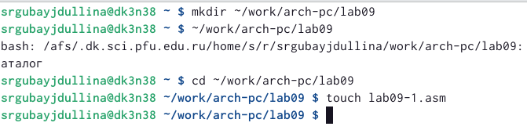{#fig:001 width=70%}

Ввожу в файл lab09-1.asm текст программы из листинга 9.1. Создаю исполняемый файл и проверьте его работу (рис. @fig:002). Файл работает корректно.

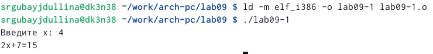{#fig:002 width=70%}

Далее мне необходимо поменять текст программы так, чтобы в нем находилась подпрограмма _subcul для вычисления выражения 𝑓(𝑔(𝑥)), где 𝑥 вводится с клавиатуры, 𝑓(𝑥) = 2𝑥 + 7, 𝑔(𝑥) =
3𝑥 − 1 (рис. @fig:003)

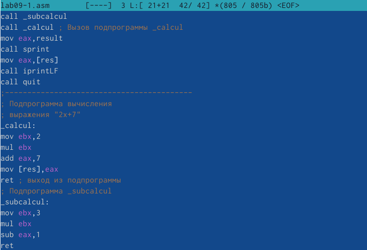{#fig:003 width=70%}

Создаю исполняемый файл для измененного lab09-1.asm и проверяю правильность работы программы (рис. @fig:004)

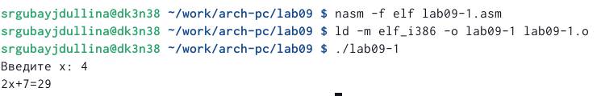{#fig:004 width=70%}

2) Создаю новый файл lab09-2.asm и ввожу туда листинг 9.2. Проверяю работу (рис. @fig:005)

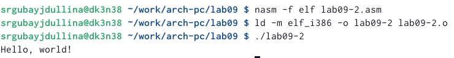{#fig:005 width=70%}

Для работы с GDB в исполняемый файл необходимо добавить отладочную информацию, для этого транслирую программы с ключом ‘-g’, загружаю исполняемый файл в отладчик gdb (рис. @fig:006) и проверяю работу программы, запустив ее в оболочке GDB с помощью команды run (рис. @fig:007)

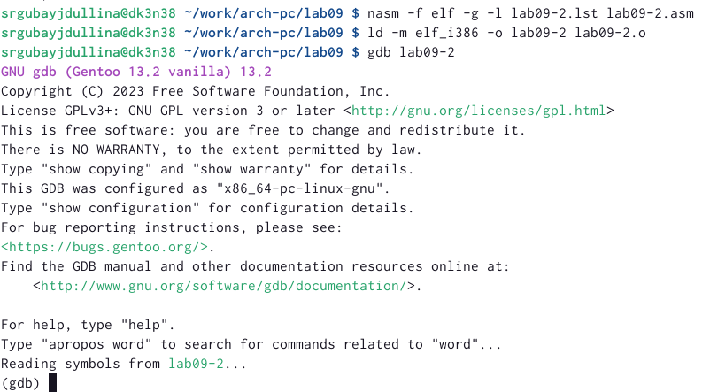{#fig:006 width=70%}

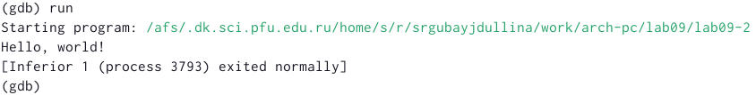{#fig:007 width=70%}

Теперь устанавливаю брейкпоинт на метку _start, с которой начинается выполнение любой ассемблерной программы, и запускаю её (рис. @fig:008)

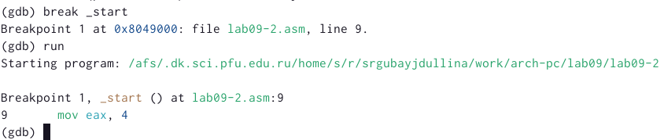{#fig:008 width=70%}

Анализирую дисассимилированный код программы, начиная с метки _start (рис. @fig:009), и сравниваю его с выводом  отображения команд с Intel’овским синтаксисом (рис. @fig:010).

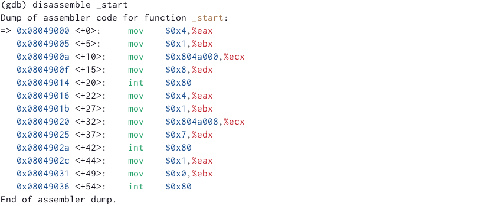{#fig:009 width=70%}

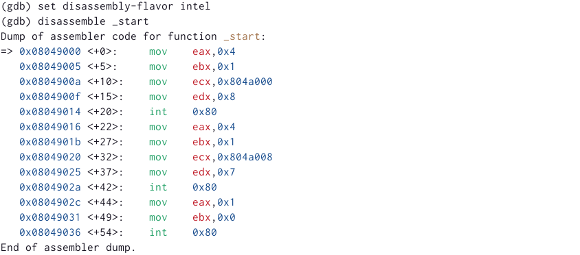{#fig:010 width=70%}

Безусловно, выводы различны. В режиме ATT имена регистров начинатся с символа %, а в синтаксисе Intel - с $.

Далее включаю режим псевдографики для работы в нём при помощи layout asm и layout regs. На предыдущих шагах была установлена точка останова по имени метки (_start). Проверяю при помощи команды info breakpoints (i b) (рис. @fig:011).

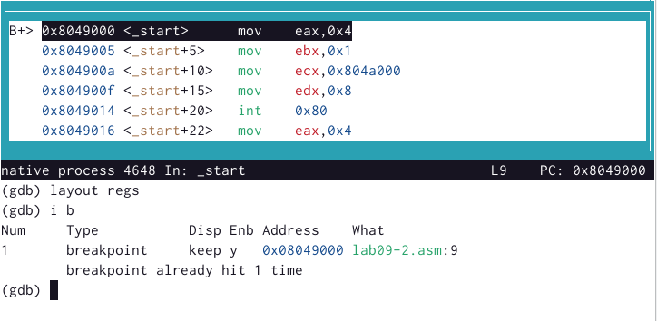{#fig:011 width=70%}

Установливаю еще одну точку останова по адресу инструкции (рис. @fig:012), а затем смотрю информацию обо всех имеющихся точках останова. 

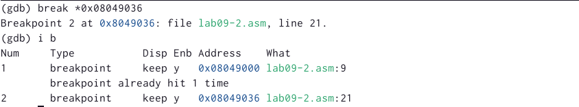{#fig:012 width=70%}

3) Далее по заданию мне необходимо выполнить 5 инструкций с помощью команды stepi (si) и проследить за изменением
значений регистров (рис. @fig:013) (рис. @fig:014) (рис. @fig:015) (рис. @fig:016).

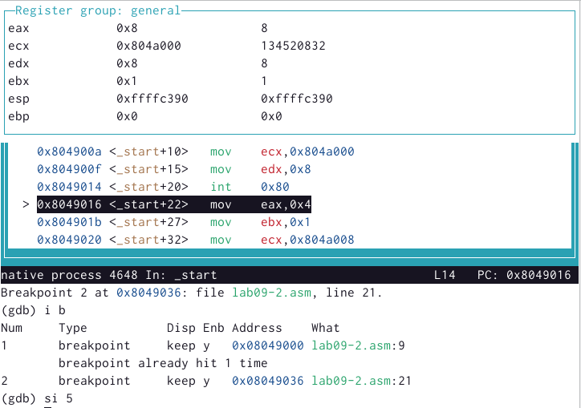{#fig:013 width=70%}

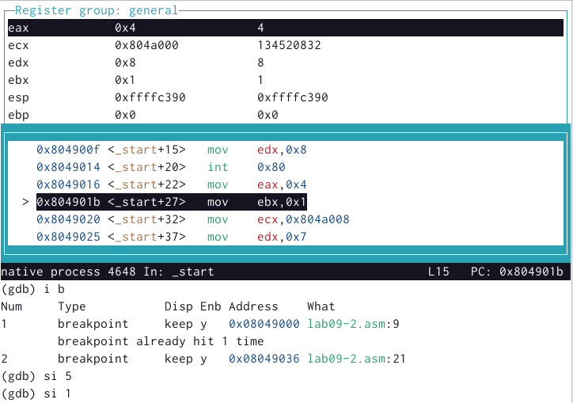{#fig:014 width=70%}

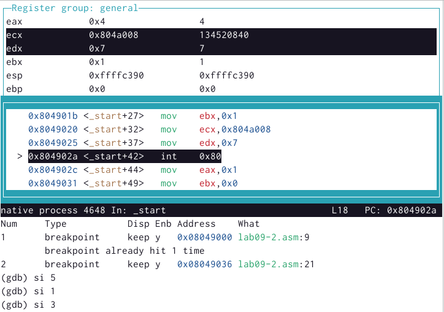{#fig:015 width=70%}

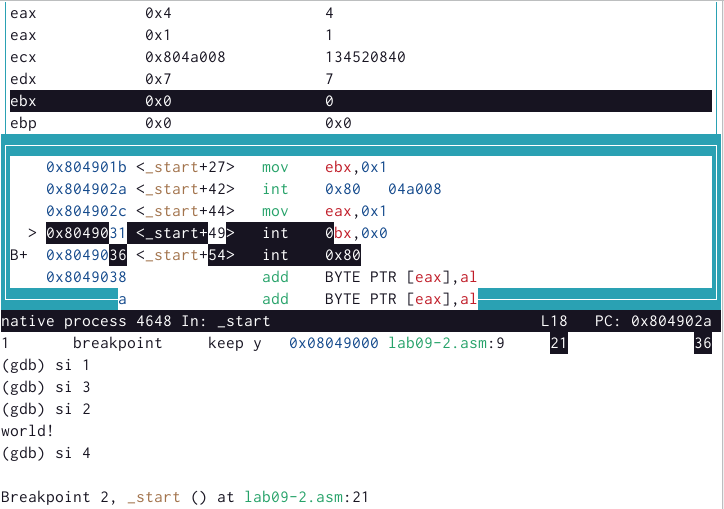{#fig:016 width=70%}

Меняются значения регистров eax, ebx, ecx, edx.

Теперь мне необходимо посмотреть значение регистра msg1, а затем значение переменной msg2 (адрес можно узнать по дизассемблированной инструкции) (рис. @fig:017).

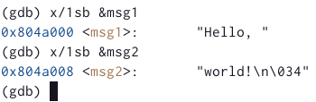{#fig:017 width=70%}

Изменить значение на 'h' для регистра msg1 при помощи set (рис. @fig:018). Так же меняю значение регистра msg2 (рис. @fig:019).

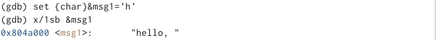{#fig:018 width=70%}

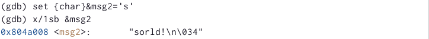{#fig:019 width=70%}

Необходимо вывести регистр edx в различных форматах (в шестнадцатеричном формате, в двоичном формате и
в символьном виде) (рис. @fig:020).

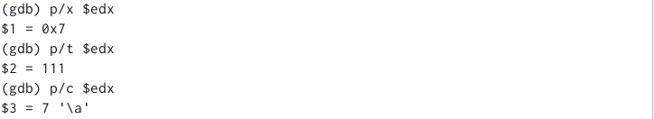{#fig:020 width=70%}

Дважды при помощи команды set меняю значение регистра ebx (рис. @fig:021) (рис. @fig:022).

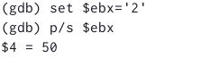{#fig:021 width=70%}

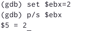{#fig:022 width=70%}

Замена произведена по-разному: в первом случае мы меняем символ в строковый вид, а во втором - число не меняется из строкового вида.

Завершаю выполнение программы с помощью команды continue (c) и выхожу (quit).

4) Компилирую файл lab8-2.asm, созданный при выполнении лабораторной работы №8, в файл с именем lab09-3.asm, создаю исполняемый файл и при помощи ключа --args загружаю исполняемый файл в отладчик (рис. @fig:023)

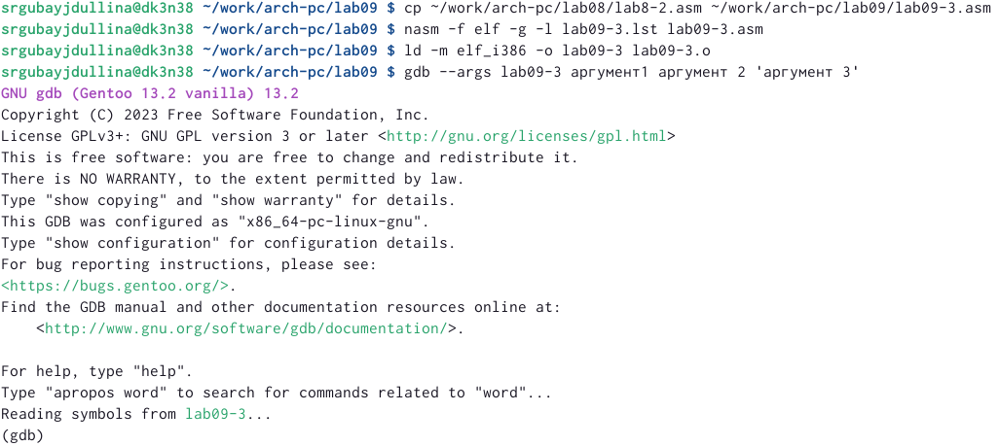{#fig:023 width=70%}

Устанавливаю точку останова перед первой инструкцией в программе и запускаю ее (рис. @fig:024).

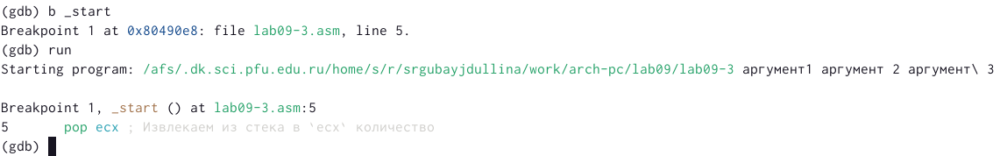{#fig:024 width=70%}

Просматриваю позиции стека (рис. @fig:025).

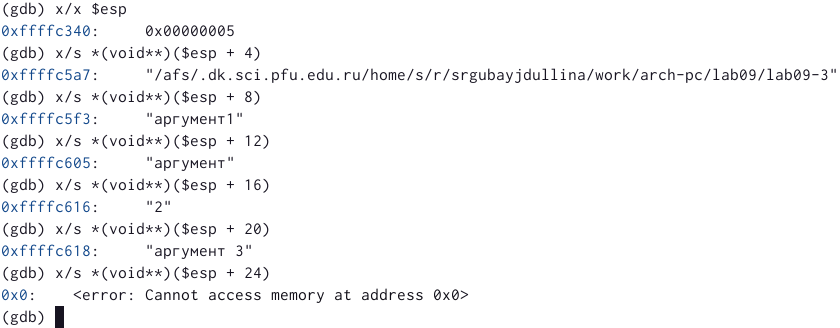{#fig:025 width=70%}

Адреса меняются с шагом 4, т.к. мы имеем 4 аргумента командной строки.

5) Для начала самостоятельной работы я преобразовываю программу из файла lab08-4.asm таким образов, чтобы вычислить значения функции 𝑓(𝑥) как подпрограмму. Работаю в новом файле lab09-4.asm:

SECTION .data
msg db "Результат", 0
SECTION .text
global _start
_start:
pop ecx
pop edx
sub ecx,1
mov esi,0
call next
next:
cmp ecx,0h
pop eax
call atoi
mov edi,3
add eax,10
mul edi
add esi,eax
jz _end
loop next
_end:
mov eax,msg
call sprint
mov eax,esi
call iprintLF
call quit
ret

Запускаю программу (рис. @fig:026).

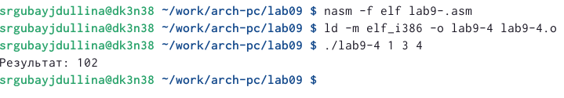{#fig:026 width=70%}

Приступаю к выполнению второй части самостоятельной работы, а именно: копирую листинг 9.3 вычисления выражения (3 + 2) ∗ 4 + 5 в новый файл lab09-5.asm. При запуске данная программа дает неверный результат (рис. @fig:027). С помощью отладчика GDB, анализируя изменения значений регистров, необходимо найти ошибку и исправьте ее.

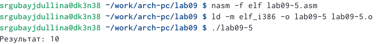{#fig:027 width=70%}

Получаю исполняемый файл для GDB и запускаю. Ставлю брейкпоинт на _start, запускаю и открываю режим псевдографики (рис. @fig:028), и теперь ставлю брейкпоинты по адресу на строчки (рис. @fig:029).

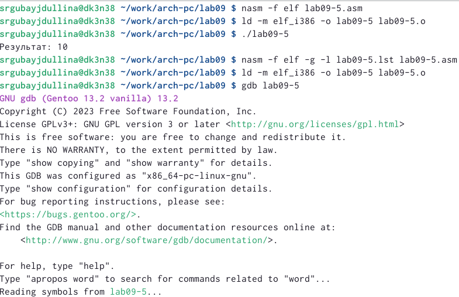{#fig:028 width=70%}

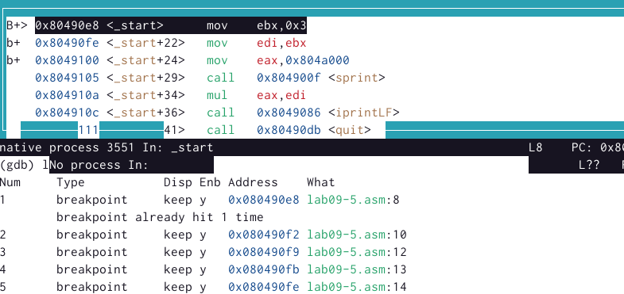{#fig:029 width=70%}

Теперь при помощи si анализирую изменения значения регистров (рис. @fig:030) (рис. @fig:031) (рис. @fig:032) (рис. @fig:033).

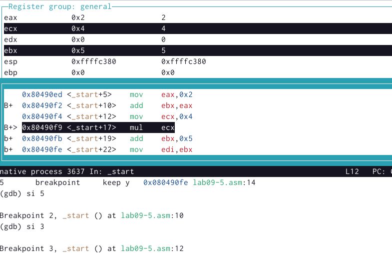{#fig:030 width=70%}

{#fig:031 width=70%}

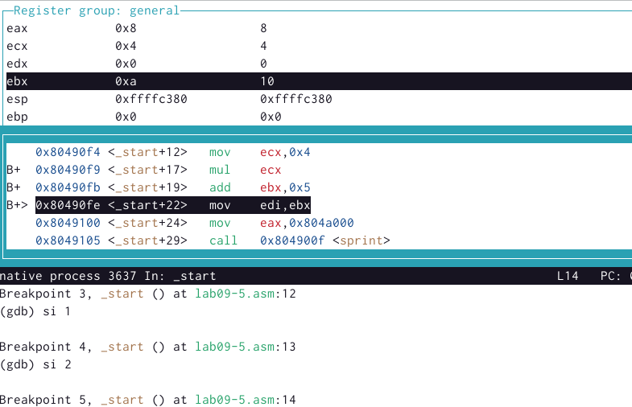{#fig:032 width=70%}

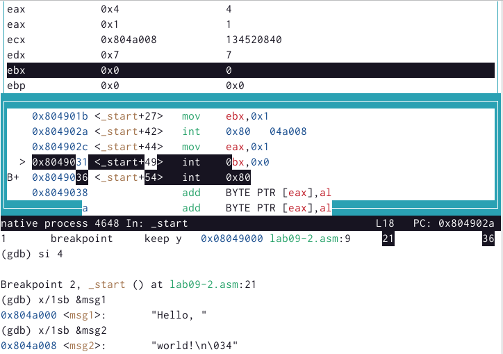{#fig:032 width=70%}

Замечаю некоторый ообенности, а именно: происходит умножение 4 на 2 (ecx*eax), вместо 4 на 5 (ecx*ebx), как требуется (регистр ebx показан обнуленным). Функции mov ecx,4; add ebx,eax; mul ecx не связаны друг с другом. Нам необходимо добавить строчку mov edi,ebx. Ещё будет нужно заменить регистр ebx на eax, чтобы связать строчки программы. Теперь программа выглядит таким образом: 

%include 'in_out.asm'
SECTION .data
div: DB 'Результат', 0
SECTION .text
GLOBAL _start
_start:
mov ebx,3
mov eax,2
add ebx,eax
mov eax,ebx
mov ecx,4
mul ecx
add eax,5
mov edi,eax
mov eax,div
call sprint
mov eax,edi
call iprintLF
call quit

Запустим программу для проверки (рис. @fig:034). Программа работает корректно.

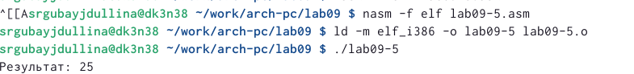{#fig:034 width=70%}
# Выводы

В процессе работы над лабораторной работой я приобрела навыков написания программ с использованием подпрограмм, а так же ознакомилась с методами отладки при помощи GDB и его основными возможностями.

