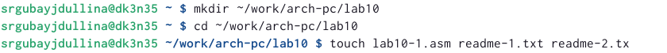
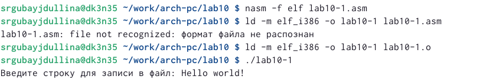
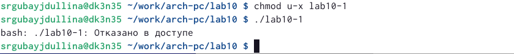
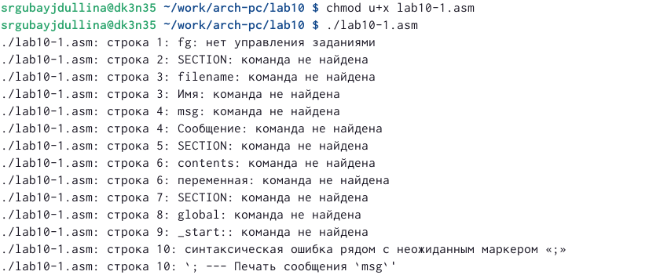
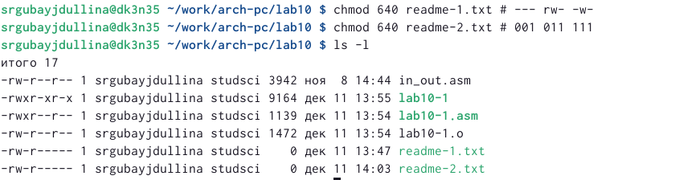
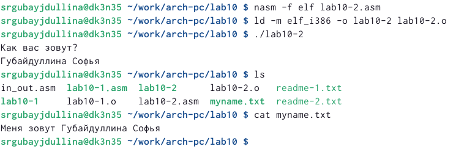

---
## Front matter
title: "Работа с файлами средствами Nasm"
subtitle: "Лабораторная работа №10"
author: "Губайдуллина Софья Романовна"

## Generic otions
lang: ru-RU
toc-title: "Содержание"

## Bibliography
bibliography: bib/cite.bib
csl: pandoc/csl/gost-r-7-0-5-2008-numeric.csl

## Pdf output format
toc: true # Table of contents
toc-depth: 2
lof: true # List of figures
lot: true # List of tables
fontsize: 12pt
linestretch: 1.5
papersize: a4
documentclass: scrreprt
## I18n polyglossia
polyglossia-lang:
  name: russian
  options:
	- spelling=modern
	- babelshorthands=true
polyglossia-otherlangs:
  name: english
## I18n babel
babel-lang: russian
babel-otherlangs: english
## Fonts
mainfont: PT Serif
romanfont: PT Serif
sansfont: PT Sans
monofont: PT Mono
mainfontoptions: Ligatures=TeX
romanfontoptions: Ligatures=TeX
sansfontoptions: Ligatures=TeX,Scale=MatchLowercase
monofontoptions: Scale=MatchLowercase,Scale=0.9
## Biblatex
biblatex: true
biblio-style: "gost-numeric"
biblatexoptions:
  - parentracker=true
  - backend=biber
  - hyperref=auto
  - language=auto
  - autolang=other*
  - citestyle=gost-numeric
## Pandoc-crossref LaTeX customization
figureTitle: "Рис."
tableTitle: "Таблица"
listingTitle: "Листинг"
lofTitle: "Список иллюстраций"
lotTitle: "Список таблиц"
lolTitle: "Листинги"
## Misc options
indent: true
header-includes:
  - \usepackage{indentfirst}
  - \usepackage{float} # keep figures where there are in the text
  - \floatplacement{figure}{H} # keep figures where there are in the text
---

# Цель работы

Приобретение навыков написания программ для работы с файлами.

# Задание

1) Использование команд chmod для изменения прав доступа к файлу;
2) Предоставление прав доступа к файлам в символьном и двочном виде;
3) Выполнение самостоятельной работы.

# Теоретическое введение

ОС GNU/Linux является многопользовательской операционной системой. И для обеспечения защиты данных одного пользователя от действий других пользователей существуют специальные механизмы разграничения доступа к файлам. Кроме ограничения доступа, данный механизм позволяет разрешить другим пользователям доступ данным для совместной
работы.

Для предоставления прав доступа другому пользователю или другой группе командой
chown [ключи] <новый_пользователь>[:новая_группа] <файл>
или
chgrp [ключи] < новая_группа > <файл>.

Буква означает наличие права (установлен в единицу второй бит триады r — чтение, первый
бит w — запись, нулевой бит х — исполнение), а дефис означает отсутствие права (нулевое значение соответствующего бита). Также права доступа могут быть представлены как восьмеричное число. Так, права доступа rw- (чтение и запись, без исполнения) понимаются как три двоичные цифры 110 или как восьмеричная цифра 6.
Тип файла определяется первой позицией, это может быть: каталог — d, обычный файл — дефис (-) или символьная ссылка на другой файл — l. Следующие 3 набора по 3 символа определяют конкретные права для конкретных групп: r — разрешено чтение файла, w — разрешена запись в файл; x — разрешено исполнение файл и дефис (-) — право не дано.
Для изменения прав доступа служит команда chmod, которая понимает как символьное, так и числовое указание прав. 

В операционной системе Linux существуют различные методы управления файлами, например, такие как создание и открытие файла, только для чтения или для чтения и записи, добавления в существующий файл, закрытия и удаления файла, предоставление прав доступа.

Общий алгоритм работы с системными вызовами в Nasm можно представить в следующем виде:
1. Поместить номер системного вызова в регистр EAX;
2. Поместить аргументы системного вызова в регистрах EBX, ECX и EDX;
3. Вызов прерывания (int 80h);
4. Результат обычно возвращается в регистр EAX.

- Для создания и открытия файла служит системный вызов sys_creat, который использует следующие аргументы: права доступа к файлу в регистре ECX, имя файла в EBX и номер системного вызова sys_creat (8) в EAX. 
_ Для открытия существующего файла служит системный вызов sys_open, который использует следующие аргументы: права доступа к файлу в регистре EDX, режим доступа к файлу в регистр ECX, имя файла в EBX и номер системного вызова sys_open (5) в EAX. 
- Для записи в файл служит системный вызов sys_write, который использует следующие аргументы: количество байтов для записи в регистре EDX, строку содержимого для записи ECX, файловый дескриптор в EBX и номер системного вызова sys_write (4) в EAX. 
- Для правильного закрытия файла служит системный вызов sys_close, который использует
один аргумент – дескриптор файла в регистре EBX. 
- Для изменения содержимого файла служит системный вызов sys_lseek.

# Выполнение лабораторной работы

1) Чтобы начать лабораторную работу, мне необходимо создать новые каталог и файл (рис. @fig:001).

{#fig:001 width=70%}

В новый созданный файл lab10-1.asm записываю листинг 10.1 (программу записи в файл сообщения), создаю исполняемый файл и проверяю работу файла (рис. @fig:002).

{#fig:002 width=70%}

С помощью команды chmod u-x изменяю права доступа к исполняемому файлу lab10-1, запретив его выполнение, а именно: как владельц (u) отменяю набор прав ("-") на исполнение файла (x) (рис. @fig:003).

{#fig:003 width=70%}

Теперь с помощью команды chmod u+x меняю права доступа к файлу lab10-1.asm с исходным текстом программы, добавив права на исполнение (как владельц (u) добавляю набор прав ("+") на исполнение файла (x) (рис. @fig:004).

{#fig:004 width=70%}

2) Далее мне требуется в соответствии с вариантом 20 в таблице 10.4 предоставить права доступа к файлу readme-1.txt представленные в символьном виде, а для файла readme-2.txt – в двочном виде.
Проверяю правильность выполнения с помощью команды ls -l (рис. @fig:005).

{#fig:005 width=70%}

3) Для выполнения самостоятельной работы создаю новый файл для работы lab10-2.asm. В нём я пишу программу для вывода приглашения о том, как зовут пользователя, с созданием нового файла и записи в него имени из сообщения. Ниже привожу листинг моей программы:

%include 'in_out.asm'
SECTION .data
filename db 'myname.txt', 0h
msg1 db 'Как вас зовут?', 0h
msg2 db 'Меня зовут ', 0h
SECTION .bss
name resb 255
SECTION .text
global _start
_start:
mov eax,msg1
call sprintLF
mov ecx,myname
mov edx,255
callsread
mov ecx,0777o
mov ebx,filename
mov eax,8
int 80h
mov ecx,2
mov ebx,filename
mov eax,5
int 80h
mov esi,eax
mov eax,msg2
call slen
mov edx,eax
mov ecx,msg2
mov ebx,esi
mov eax,4
int 80h
mov ebx,esi
mov eax,6
int 80h
call quit

Создаю исполняемый файл и проверяю работу. При  помощи ls и cat проверяю наличие файла и его содержимое (рис. @fig:006)

{#fig:006 width=70%}

# Выводы

В ходе выполнения лабораторной работы я приобрела навыки написания программ для работы с файлами.

